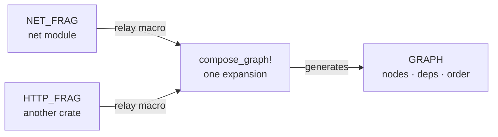

<p class="eyebrow">Concepts</p>

# Fragments and sub-graphs

`supervisor_graph!` is one closed invocation, but it does not have to be one
closed file, and one binary can hold more than one graph.

## Fragments across crates

A module or a whole crate declares its slice of the graph as a **fragment**;
one compose site assembles them:

```rust
// net.rs, or a separate crate:
embassy_supervisor::supervisor_fragment! {
    name: NET_FRAG;
    node NET = Terminate, task: crate::net::net_task,
        resources: [USB_DEV: Peri<'static, USB>];
}

// main.rs, the one compose site per binary:
embassy_supervisor::compose_graph! {
    fragments: [NET_FRAG, ::http_stack::HTTP_FRAG],
    graph: {
        node APP = Terminate, deps: [NET], task: app_worker; // cross-fragment dep
    }
}
```

A fragment emits a relay macro that forwards its items, verbatim with their
spans, into the compose site's single expansion. Every compile-time pass
still sees the whole graph: cross-fragment deps resolve by name in either
direction, duplicate names and shared-slot shape mismatches error with the
owning fragment named, and the topological order and the 256-node cap span
everything. All statics land at the compose site.

Rules worth knowing:

- A fragment references its own items with plain `crate::…` paths; the macro
  normalizes them so they resolve to the fragment's crate at any compose
  site. Another crate's items take a fully-qualified `::crate_name::…`.
- `#[cfg(...)]` inside a fragment is evaluated against the **composing
  crate's** features. A fragment crate wanting feature-dependent shapes
  exports differently-named fragment variants instead.
- One compose site per binary: it emits the graph statics and, under
  `trace-hooks`, the hook symbols.



## Several graphs in one binary

`name: IDENT;` as a graph's first item renames the emitted static, so an
always-on primary graph and a cycled secondary coexist:

- The unnamed graph is the **primary**: only it emits the once-per-binary
  trace hook symbols. Named graphs still link into the trace recorder chain
  when they start.
- The control mailbox and pool scale signal are **shared**: run one driver
  loop and apply each command to every supervisor in turn; a command naming
  a node outside a supervisor's graph is a safe no-op.
- Node and resource statics keep their declared names in both graphs, so
  reuse of a name in one module is an ordinary duplicate-static error. The
  256-node cap is per graph.

## A sub-graph under an application state machine

The graph does not have to own your `main`. A state-machine firmware keeps
its sequencing and its per-state data, while a dedicated named sub-graph is
cycled with whole-graph operations, dependency-ordered in both directions:

```rust
supervisor_graph! {
    name: UPLOAD_GRAPH;
    node WIFI   = Terminate, task: wifi_ctrl,
        resources: [WIFI_HW: consume WifiController<'static>];
    node NET    = Terminate, deps: [WIFI], task: net_runner;
    node UPLOAD = Terminate, deps: [NET], task: upload_worker;
}

let sub = Supervisor::new(&UPLOAD_GRAPH);
// in State::Upload:
WIFI_HW.provide(build_wifi(&mut ctx).await); // rebuilt per entry
sub.start(&spawner).await?;                  // WIFI -> NET -> UPLOAD
// ... the state machine stays in charge ...
sub.teardown().await?;                       // UPLOAD -> NET -> WIFI
```

`start()` is the universal quiescent-to-running op, so mixed-mode sub-graphs
cycle correctly: nodes reset per cycle, running and detached ones are
skipped, a `Pause` instance parked by the previous teardown is resumed in
place rather than double-spawned, and `consume` slots turn "rebuild the
radio each entry" into fail-closed freshness. `teardown()` awaits every ack,
so re-entering a state cannot race the previous instances.

**The one-graph variant**: declare the subtree `Terminate` + `disabled` in
the main graph and drive it with cascades (`activate` on the leaf, or
`request_control` from anywhere, when the supervisor lives inside a `run()`
driver). Prefer that when the subtree depends on always-on nodes (graphs are
closed worlds; there are no cross-graph dep edges) or should ride the
system-wide sleep/wake lifecycle.

## Next

[Heap and state](/concepts/memory/) closes the
concepts: what may be reclaimed and what the graph keeps static.
