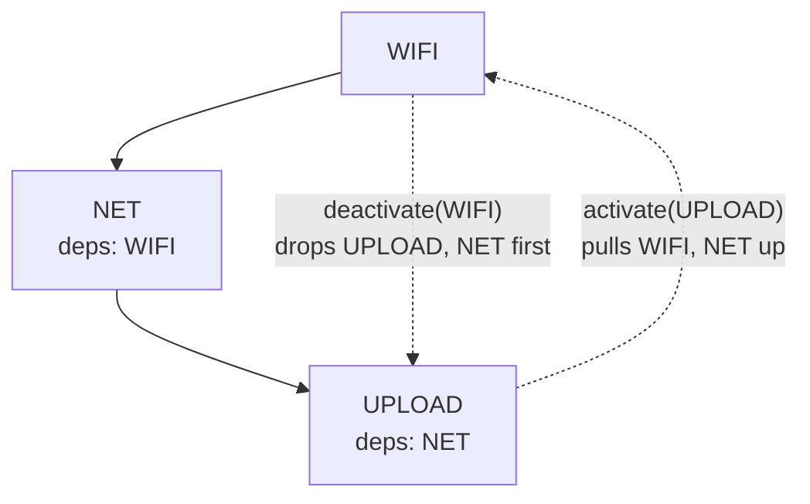

<p class="eyebrow">Concepts</p>

# Runtime control

Feature `control` turns the graph from a boot-time construct into something
you can drive at runtime, from anywhere: a request handler, a button, a
shell, a test.

## The mailbox

Code that does not hold the supervisor talks to it through a decoupled,
**lossless** mailbox:

```rust
use embassy_supervisor::{request_control, try_request_control, ControlOp};

// Async: waits for mailbox capacity if the queue is full.
request_control(&OTA, ControlOp::Activate).await;

// Sync (an ISR, a callback): reports a full queue instead of waiting.
if try_request_control(&OTA, ControlOp::Activate).is_err() {
    // mailbox full: log, drop, or escalate
}
```

`ControlOp` is `Activate`, `Deactivate`, and with the `restart` feature
`Restart` (the enum is `#[non_exhaustive]`: further verbs may arrive without
a breaking change). The higher-level verbs (start, stop, pause, resume) fold
onto `Activate`/`Deactivate` according to the node's mode. The supervisor
side applies each command with `apply_control`, which is dependency- and
pool-aware. Mailbox depth is 4.

The verbs that live directly on `Supervisor` when you do hold it:
`start_node`, `stop_node`, `resume_node` (single node, no cascade), and the
cascading pair below.

## Cascades

`activate` and `deactivate` expand through the graph:

- **`activate(&node)`** pulls the node's transitive **dependencies** up in
  start order (skipping already-running ones). Activating a leaf rebuilds
  its whole supply chain.
- **`deactivate(&node)`** stops the node and its transitive **dependents**
  in reverse order. The target itself is marked `disabled`; its dependents
  get the **`collateral`** hold instead, so retiring a subtree does not
  brand every node in it as manually stopped.

The pair is symmetric over a subtree: the way back from `deactivate(NET)`
is `activate(NET)`. It clears the latch, then releases every collateral
dependent with no disabled node left in its transitive dependencies.
Released `Terminate` and `Pause` nodes restart in the same wave; released
`OnDemand` pool members are left to the elastic policy. Overlapping
deactivations compose: a node under two deactivated ancestors comes back
on the second `activate`, and a node deactivated directly keeps its latch
through an ancestor's cycle. `start_node` overrides the hold by hand.

Both latches survive wake respawns and pool regrows; only `activate`
clears them. `activate` on a **pool member** expands to the whole pool:
respawn the floor, re-enable the on-demand members.



Of the two, only `deactivate` returns a `Result`: an `Err` is the ordinary
fault shape, most commonly a `ShutdownTimeout` naming a node that missed its
ack. `activate` returns nothing: spawn errors during the cascade are
deliberately swallowed (the cascade is best-effort bring-up; the failed node
reads `!is_running()` and reports itself).

## `restart`: one subtree cycles

Feature `restart` cycles a node **and its transitive dependents**: stop the
subtree, reset, then bring it back up through the full gate sequence
(resources re-gated, ready deps re-awaited). A node that went stale can be
cycled in place:

```rust
// health monitor, somewhere in the app:
loop {
    let event = embassy_supervisor::wait_health().await;
    if let HealthKind::Stale { .. } = event.kind {
        let _ = sup.restart(event.node, &spawner).await;
    }
}
```

`Pause` nodes in the subtree are resumed, never respawned (their parked task
keeps its state and its task-pool slot). The disabled latch sticks: a
manually stopped node is not revived by a restart above it.

## The split single-node verbs

Use `start_node` / `stop_node` when you mean exactly one node and no cascade:
pausing one service for a maintenance window, probing a respawn. `stop_node`
on a `Pause` node is the single-node pause: it acks and parks, and
`resume_node` thaws it in place, keeping held resources.

## What skips everything

A **detached** node is outside all of this: never stopped, never restarted,
never pulled into a cascade, even when targeted directly. Its `deps:` ordered
its first spawn; after that the graph only remembers where it was declared.

## Next

[Health monitoring](/concepts/health/) is the natural
producer of control decisions.
