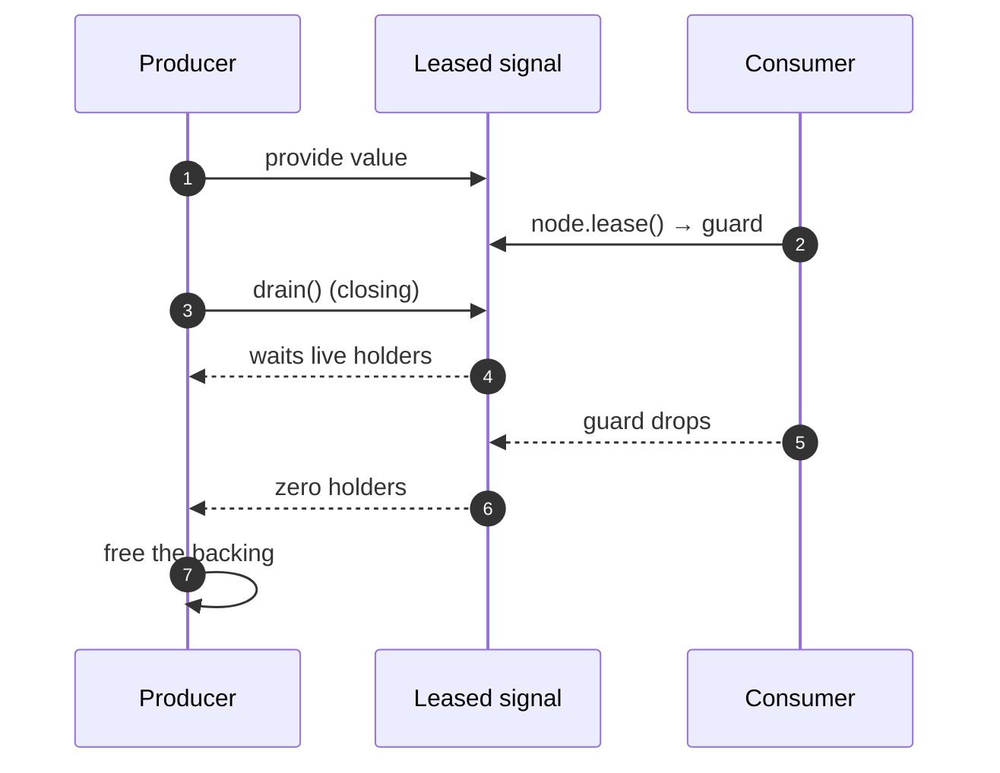

<p class="eyebrow">Concepts</p>

# Gated reads and leases

Feature `data-deps` makes a signal's type carry what reading it implies, on
both edges of a task's life: **bring-up** (a read that waits for its
producer) and **teardown** (a producer that waits for its holders).

## The bring-up side: `Backed` and `open`

Some couplings are not merely observed but depended on: an estimate means
nothing until the node producing it is up. Writing `deps: [ESKF ready]` in
every consumer states that once per consumer, by hand, in a place that has
forgotten which signal motivated it. A gate moves the obligation onto the
signal:

```rust
// The declaration says what reading it implies. Backed starts the producer
// on first open (needs `control`), then waits for its readiness.
pub static ESTIMATE: Backed<Watch<CriticalSectionRawMutex, Estimate, 4>> =
    Backed::new(Watch::new());

// The consumer states a read, and Deref keeps the wrapped API:
let mut rx = node.open(&crate::ESTIMATE).await.receiver().unwrap();
```

**Nothing names the producer.** The graph already knows who writes a signal,
so the gate resolves the producer by the static's address, over the caller's
own graph, covering `discover`-derived tables no declaration site could
name. Two graphs in one binary never answer for each other.

`open` is the only awaiting verb, it fires once per consumer at setup, and it
grants no exclusive access. There is deliberately **no blanket impl** of the
`Gated` trait: calling `open` on an ungated signal is a compile error rather
than a no-op the reader would mistake for a guarantee. Write your own gate by
implementing `Gated::ensure`: it receives the reading node and the coupling
entry, so it can log the caller, throttle a first access, wait on a mode,
anything, including awaiting.
One trap the graph cannot catch: coupling tables may legitimately be cyclic,
so an `open` from a task the producer transitively `deps:`-on deadlocks
silently. The producer's bring-up waits on the opener (a `ready` dep, a
resource it provides) while the opener waits on the producer, and nothing
faults. Open such a signal only after satisfying whatever the producer's
bring-up gates on, for example after this task's own `set_ready()`.

## The teardown side: `Leased` and `drain`

The edge that bites: a task that published a handle into a static (a network
stack, a DMA buffer, a peripheral view) cannot free it while a consumer is
still holding it. No declaration answers that, because coupling tables are
best-effort by construction: an unadopted helper, a computed target or a
forgotten entry is simply absent, and ordering a lifetime invariant on "not
mentioned" is not sound. So the holders are **counted** instead:

```rust
pub static NET_STACK: Leased<StackCell> = Leased::new(StackCell::new());

// The consumer holds the guard exactly as long as it uses the value.
let Some(stack) = node.lease(&crate::NET_STACK) else { return };
serve(*stack).await;

// The producer, on its way down, before freeing the backing:
crate::NET_STACK.drain().await;
```

`drain` closes the signal to new leases, then waits for the live ones to
drop. Closing is what makes the count trustworthy: afterwards an asker gets
`None`, the honest answer, rather than a handle about to dangle. A producer
that comes back up calls `reopen`.



What this buys over a `deps:` edge is exactness: the count covers **every**
holder, including a consumer no table carries and a `detached` node, which
teardown skips entirely and which therefore escapes any ordering-based
scheme. The failure mode is a leaked guard: `drain` never returns, the
producer misses its shutdown ack, and the shutdown ack timeout names the
producer. A use-after-free becomes a loud timeout.

Cost: one `AtomicU32` and one signal per leased signal, nothing for signals
that opt out. `lease` is sync; `open` is async; both record the coupling, and
the diagram tool draws them as their own edge kinds.

## Ordering that lives entirely in the couplings

`deps:` is optional. A graph whose ordering lives entirely in its
runtime couplings is a first-class shape: gated reads bring producers up on
first use, lease drains order teardown, channel rendezvous sequence the
middle. The zero-sized `Flat` topology means such a graph pays no dependency
bookkeeping at all. Reach for it when the dependency structure is genuinely
dynamic, for example a lazily-started radio that comes up when the first
consumer reads from it, not at boot.

## Next

- [Elastic pools](/concepts/pools/) for the worker
  side of dynamic capacity.
- [Testing on your desktop](/guides/testing/) shows
  how to pin gate and lease behavior in host tests.
