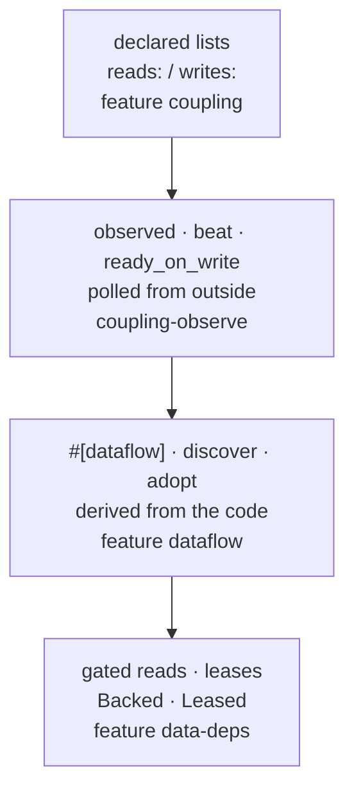
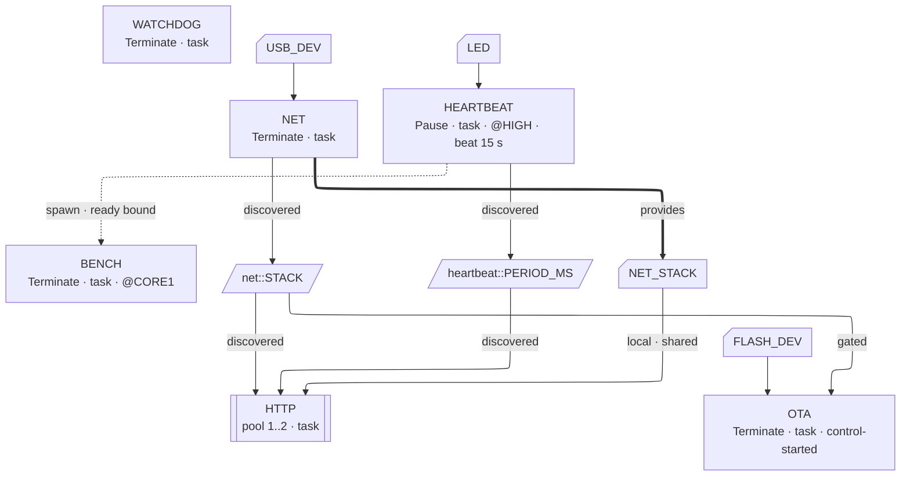

<p class="eyebrow">Concepts</p>

# Dataflow

Dependencies order *when tasks run*. Dataflow describes the other half: *what
data flows between them while they run*. The record the supervisor keeps is
short: **for each signal, which node writes it, which nodes read it.** From
that record you get answers ("who is affected if this producer cycles?"),
heartbeats, readiness, tooling, and lint findings for one-sided signals.

The layers stack; stop at any of them.



## Declared lists

The hand-written tier, for bodies you do not own. Entries name the **actual
signal statics**, checked to exist and be `Sync`, so a rename breaks every
referring declaration:

```rust
pub static ESTIMATE: embassy_sync::watch::Watch<CriticalSectionRawMutex, Estimate, 4> =
    embassy_sync::watch::Watch::new();
pub static MOTOR_SP: embassy_sync::watch::Watch<CriticalSectionRawMutex, [f32; 4], 4> =
    embassy_sync::watch::Watch::new();

supervisor_graph! {
    node CONTROLLER = Terminate, deps: [ESKF ready],
        reads:  [crate::signals::ESTIMATE],
        writes: [crate::signals::MOTOR_SP],
        task: crate::controller::entry;
}
```

That is the whole check: existence and `Sync`. The list is never verified
against the body. Couplings beside a node's deps also say which edges carry
data: a dep edge with no coupling beside it is pure ordering, and now reads
as one.

Queries over the record are visitor-style: `GRAPH.writers_of(&entry, &mut
|i, node| ...)` and `GRAPH.readers_of(..)`, where `entry` is a `&Coupling`
from a node's `writes()`/`reads()` tables. The diagram tool draws the same
edges.

## `observed` and `beat`: liveness without touching the task

An entry marker can name an accessor whose result changes when the signal is
written. With the `liveness-monitor` feature, a `beat`-qualified write
becomes the node's heartbeat: the monitor's sweep treats an advancing value
as a sign of life, so the task never calls `beat()` itself. Neither the
signal crate nor the task body learns the supervisor exists.

```rust
node ESTIMATOR = Terminate, beat_timeout: 1000,
    writes: [crate::signals::ESTIMATE observed beat],
    task: crate::estimator_task;
```

The accessor resolves from three places, most specific first: `observed via
<expr>` on the entry (for example `it.load(Ordering::Relaxed)`, or one
element of an array), a graph-level default, or the `Observable` trait from
the tiny `embassy-supervisor-observe` facade, which a signal library
implements in one line without depending on the supervisor. The atomics
implement it directly, value as token.

`ready_on_write` takes the same advance as the node's readiness assertion:
"ready" becomes *actually producing* rather than *reached the line that says
so*. It is monotone by design; a node that later goes quiet is reported
through the health monitor, and what to do about that is your call.

Two honest caveats:

- Polling watches only the signal the declaration names, at the sweep's
  resolution. That is the price of asking nothing of the task.
- A queue's `len()` is **not** a change token: a channel that fills and
  drains between sweeps reads identical and looks silent. Wrap it in the
  facade's `Counted`, whose token is the write count, before pairing
  `observed` with `beat`.

## `#[dataflow]`: the record derived from the code

The top tier for code that holds its node. Accesses go **through the node**:
`node.put(&SIG, v)` and `node.get(&SIG)` perform the operation, and
`node.writer(&SIG)` / `node.reader(&SIG)` hand the signal back for its own
API. The attribute scans the fn for those calls and emits its coupling tables
beside it. The call site is the declaration, so it cannot drift.

```rust
#[embassy_supervisor::dataflow]
async fn eskf_task(node: &'static TaskNode) {
    let mut imu = node.reader(&IMU_DATA).receiver().unwrap(); // pass-through
    loop {
        let est = fuse(imu.changed().await).await;
        node.put(&crate::signals::ESTIMATE, est);   // Sink: the verb writes
        node.beat();                                // the sign of life
    }
}

// node ESKF = Terminate, deps: [IMU ready], task: eskf_task, discover;
```

Two ways the graph binds derived tables:

- **`discover`**: the `task:` fn's own tables are the node's declaration. A
  list may sit beside it to add **markers only** (`observed`, `beat`) to
  signals the scan already found.
- **`dataflow: [path]`**: adopt an annotated helper's tables. The scan sees
  one body at a time, so helpers must be annotated and adopted by their
  callers; a module of them rolls up with `#[dataflow_bundle]` and adopts as
  one entry.

This is also how **private signals stay private**: a setter behind a module
boundary takes the caller's node, carries `#[dataflow]`, and callers adopt
it. The write attributes to the caller; the static never leaves its module.

```rust
// heartbeat.rs: the static never leaves the module
static PERIOD_MS: AtomicI32 = AtomicI32::new(500);

#[embassy_supervisor::dataflow]
pub fn set_period_ms(node: &'static TaskNode, ms: i32) {
    node.put(&PERIOD_MS, ms);
}

// any node: dataflow: [crate::heartbeat::set_period_ms]
```

Verbs are inherent methods on `TaskNode`, so an extension trait can register
more (`#[dataflow(read(subscribe), write(publish))]`): the scan needs the
name and the direction, both stated, both checked. Built-ins stay
recognized; redefining one is an error. A house verb set wants a wrapping
attribute macro on your side, which is the main ergonomic cost of this tier.

The pass-through pair exists for the two patterns a value verb cannot
express: read-modify-write (`node.writer(&COUNT).fetch_add(1, ..)`) and
consuming reads with per-consumer handle state.

## The runtime view

Every diagram on this page is a facet of one declaration. The runtime view
draws all three relations at once: spawn edges, signals with their
discovered readers, and resource slots with their providers. This is the
graph of a small connected device, in the notation the
[`supervisor-mermaid`](/guides/tools/) tool emits:



Dotted edges are relations that hold for an instant or are polled; solid
edges carry data for the life of the run. The cycle through the signal boxes
is legitimate: dataflow may be cyclic, and that is exactly why it never feeds
the topological sort.

## Cost model

The heartbeat is lazy: a plain `put` costs nothing beyond the write, a
`beat_put` adds one relaxed store, and a beat materializes only when someone
asks about staleness. A 1 kHz writer pays no timer reads. Readiness is the
exception (asserted at the access, once per activation). On hot paths that
publish other memory through their own atomics, keep the ordering yourself
(`node.writer(&FLAG).store(v, Release)`).

## Channels and mutexes are couplings too

Identity is the static's address, and the blanket coupling impl covers every
`Sync` type: a `Channel`, a `Mutex`, a queue, a driver handle. The value
verbs do not fit them by design (`put` is sync and infallible; a bounded
`send` is neither), so use the pass-through verbs or register your own:

```rust
pub static CHAN: Channel<CriticalSectionRawMutex, u32, 4> = Channel::new();

#[dataflow]
async fn producer(node: &'static TaskNode) {
    node.beat_writer(&crate::CHAN).send(1).await; // heartbeat on a send
}
```

One honesty note on direction: for shared mutable state, `reads:`/`writes:`
records "these nodes are coupled through this thing", which is useful and
true; do not read it as production and consumption.

## Next

[Gated reads and leases](/concepts/data-deps/) turn
these declarations into behavior on both edges of a task's life.
