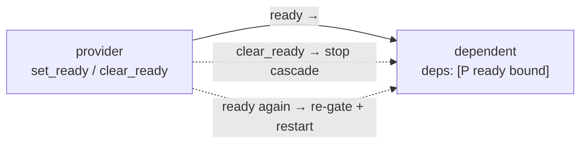

<p class="eyebrow">Concepts</p>

# Dependencies and gating

`deps:` names the nodes (or pools) a node must come up after. That is the
whole job of a plain edge: **it orders starts and stops**. Whenever the
supervisor starts or stops anything (bring-up, teardown, a control cascade,
pool growth), the edges decide who moves first. What a plain edge never
does is watch a running task: a provider going down later does not stop its
dependents. Continuous coupling is a marker on the edge, not the edge
itself:

| declaration | relates | applies |
|---|---|---|
| `deps: [X]` | start and stop order | every start and stop decision |
| `deps: [X ready]` | start order + a startup rendezvous | every spawn of the dependent |
| `resources:` / `provides:` | ownership of a value | once per activation, gated on the value |
| `reads:` / `writes:` | dataflow | the whole run, may be cyclic |
| `deps: [X ready bound]` | runtime state propagation | continuous, opt-in per edge |

One meaning per declaration. Reading a `deps:` edge as "A feeds B" is the
classic conflation; the feeding is dataflow and has its own clause.

## Plain edges

```rust
supervisor_graph! {
    node NET  = Terminate, task: net_task;
    node HTTP = Terminate, deps: [NET], task: http_worker;
}
```

`HTTP` spawns once `NET` is up. "Up" means spawned and marked running, which
says nothing about `NET`'s body having achieved anything: a plain edge is a
sequencing statement, not a readiness statement. A pool name in `deps`
resolves to the pool's floor member: `deps: [WORKERS]` means "after the
always-on member is up".

The edge runs in reverse when things stop: `HTTP` is down before `NET` on
teardown, and `deactivate(NET)` takes `HTTP` with it.

## The `ready` marker

The most common marker. The dependent's spawn additionally waits for the
dep's task to call `set_ready()`:

```rust
supervisor_graph! {
    node NET  = Terminate, task: net_task;
    node HTTP = Terminate, deps: [NET ready], task: http_worker,
        slot_timeout: 10000; // how long HTTP's spawn waits for NET
}
```

```rust
async fn net_task(node: &'static TaskNode) {
    bring_link_up().await;      // DHCP, registration, calibration...
    node.set_ready();           // now dependents may spawn
    let _ = node.run_cancellable_acked(serve()).await;
}
```

Semantics worth knowing:

- `set_ready()` latches until `clear_ready()` or the next pre-spawn reset, so
  a respawned provider re-asserts for its new instance.
- The wait is bounded by the **dependent's** `slot_timeout` and fails the
  spawn with `FaultKind::ReadyDepTimeout { dep }`, which names the dep that
  never asserted. A provider that never becomes ready is a loud, retryable
  error.
- `clear_ready()` is **status, not control**: already-running dependents keep
  running. Future spawns and pool growth wait. If you want a cascade, pair it
  with a control `Deactivate`, or opt the edge into `bound`, next.
- Elastic-pool growth also defers while a `ready`-marked dep is unready.
- `wait_ready()` exists for app code, with a single-waiter caveat shared by
  all latching gates: fan N waiters out through an app-owned `Watch`.

Pick the rendezvous by what crosses the edge: a **value** wants a resource
slot, a **state** wants `ready`. Both on one edge for one fact is redundant.

## The `bound` marker

`deps: [X ready bound]` (feature `bound-deps`) makes one edge continuous: if
the provider's readiness is withdrawn, the dependent is **stopped**, and it
comes back when the provider is ready again.



It is the one feature that changes a documented contract (a `clear_ready`
that previously only deferred spawns), which is why it is per-edge opt-in.
Reserve `bound` for providers that **fail**: a link that drops, a producer
that exits. For providers that merely **suspend** (a `Pause` node parks with
its state intact), a plain `ready` edge is the honest declaration: nothing
went stale, and resume puts everything back.

## `epochs`: noticing a restart underneath you

A plain `deps:` edge never re-gates a running node when a provider cycles
underneath it. The continuous exception
is the `bound` marker above, which stops the dependent when its provider goes
down and restarts it, gates re-evaluated, when the provider is ready again.
When a *running* consumer must merely **notice** the cycle (it cached a
negotiation the provider redoes per instance), the `epochs` feature gives
each node a generation counter: `node.epoch()` and
`node.wait_epoch_change(seen)`. Pure status; the reaction is yours.

## Gates and budgets

Before a task can start, three things must be in place: its `executor:`
slot is filled, every `resources:` value has been provided, and every
`ready` dep has called `set_ready()`. These are the task's **gates**. The
wait is always bounded by `slot_timeout:` (100 ms by default), and a gate
that never opens fails as a named fault, never a hang.

When `start()`
brings the whole graph up, one budget covers all of a task's gates
together, counted from the moment its dependencies are up; the
single-node verbs (`start_node`, and the cascades built on it) instead
give each gate its own budget. The default assumes values provided before
`start()`; a provider that takes hundreds of milliseconds to build its
output needs a raised budget on its consumers.

`beat_timeout: 0` is a compile error: a zero budget would report the task
stale on every sweep. Omit the clause to leave a task unpoliced; the other
limits are collected in
[Errors and limits](/reference/errors/).

## Next

- [Dataflow](/concepts/dataflow/) for the continuous
  half of the graph.
- [Runtime control](/concepts/control/) for driving
  these transitions from request handlers and buttons.
