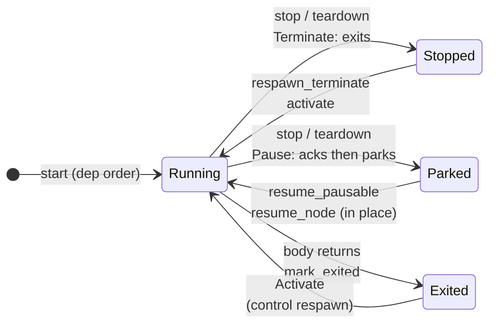

Concepts

# Lifecycle and modes

A node's mode decides what each lifecycle transition does to it. Three modes
and three cross-cutting flags cover everything.

| mode | at boot | on teardown | on wake re-bring-up |
|---|---|---|---|
| `Terminate` | spawned | exits and acks | **respawned** fresh |
| `Pause` | spawned (or app-spawned) | acks, then parks on `wait_resume()` | **resumed in place**, keeps held resources |
| `OnDemand` | not started | stopped if running | left down; the pool policy regrows it |

Three flags cut across the modes:

- **`disabled`** (the `disabled;` clause, or a control `Deactivate` on the
  node itself) is the "someone said stop" latch. Every bring-up path honors
  it, so a manual stop survives a wake respawn or an elastic regrow, until
  an `Activate` clears it.
- **`collateral`** (`TaskNode::is_collateral()`) marks a node stopped only
  as a *dependent* of a deactivated node. It blocks bring-up exactly like
  `disabled`, but `activate` on the ancestor releases it once no disabled
  node remains among its transitive dependencies. `start_node` overrides
  the hold.
- **`detached`** (`set_detached(true)`) is full hands-off. The supervisor
  starts a detached node once, then never drives it again: teardown,
  cascades, stop and respawn all skip it. Its `deps:` still order its first
  spawn.

## The operation matrix

The canonical behavior per operation. "Cascade" rows expand through the
graph: `activate` expands dependencies upward, `deactivate` expands
dependents downward.

| operation | Terminate | Pause | OnDemand | disabled | detached |
|---|---|---|---|---|---|
| `start` | spawn in dep order; idempotent | spawn cold, or **resume** an instance parked by an earlier teardown | skipped | skipped | first start spawns it; re-entry skips |
| `teardown` | stop + ack | stop + ack, parks | stop if running | nothing to do | skipped |
| `deactivate` | seed: disabled + stopped; transitive dependents: `collateral` + stopped, dependents first | disabled (or `collateral`) + stopped, parks | disabled + stopped, the whole pool when a member is the target; `collateral` as a dependent | re-disabled (idempotent) | skipped, even when targeted |
| `activate` | enabled + started after its transitive deps; a `collateral` dependent with no disabled dep left is released and restarted in the same wave | enabled + resumed in place | enabled/released only, policy regrows | clears the latch | skipped |
| `resume_node` | no-op (wrong mode) | reset + resumed in place | no-op | skipped | no-op |
| `restart` | cycle node + transitive dependents, re-gated on the way up | resumed, never respawned | left down | skipped | skipped |
| `respawn_terminate` | reset + respawn in dep order | untouched | left down | skipped | skipped |
| `resume_pausable` | untouched | reset + resumed in place | untouched | skipped | left parked |

Worth knowing: the pair is symmetric over a subtree. `deactivate(NET)`
stops NET's dependents under the `collateral` hold, and `activate(NET)`
brings the chain back: it clears the latch and releases every held
dependent with no disabled node left in its dependencies. Released
`Terminate` and `Pause` nodes restart in the same wave; released
`OnDemand` pool members are left to the elastic policy. Overlapping
deactivations compose: a node under two deactivated ancestors comes back
on the second `activate`, and a node deactivated directly keeps its latch
through an ancestor's cycle. `start_node` overrides the hold by hand.

## Stops are a wave, not a loop

Teardown does not walk the order array one node at a time. It computes, at
each moment, every node whose stopping dependents have all acked, and signals
exactly those. The consequences are worth internalizing:

- A dependency **keeps serving** while its dependents stop, because it is not
  even signalled until they are gone. A dependent may flush one last buffer
  over a link or drive a final ioctl through a runner it depends on, inside
  its own shutdown.
- Nodes with no ordering relation to each other stop **concurrently**. Write
  stop paths against that contract: a node may be told to stop while an
  unrelated service is still running, so it frees what it owns as soon as it
  acks and must not assume unordered services still work.

A missed ack is an error, never a hang: every stop path awaits the ack with
a 2 s timeout and returns `ShutdownTimeout` naming the node. The default is
per-node overridable with `ack_timeout:`, for cleanup that legitimately
takes longer; each node's window runs from the moment it is signalled.

A stop that times out still releases the node's divisible shares: a wedged
holder cannot strand its claim. A `Pause` park is the exception, since the
task is coming back.
`teardown` aborts at the first timeout so a still-live dependent never has
its dependencies stopped under it; `teardown_continue` is the best-effort
variant for the "reset next anyway" path.

## Starts are a wave too

`start`, `activate` and `restart`'s up half spawn every node whose
in-pass dependencies are up and whose gates test satisfied, on each round,
parking between rounds on a gate-event signal (a slot was filled, an executor
slot was set, readiness was asserted). Independent slow bring-ups overlap
instead of queueing, and spawn ordering stays strict: a dependent never
spawns before its in-pass deps. In a `start()` wave a node's `slot_timeout`
covers all its gates together, from the moment its dependencies resolve; the
single-node verbs (`start_node`, and through them the cascades) budget per
gate instead.

## Defaults, in one place

Shutdown-ack timeout **2 s** (per node overridable with `ack_timeout:`; the
window starts when the node is signalled). Pre-spawn gate wait **100 ms**
per node (override with `slot_timeout:`). Control mailbox depth **4**. Trace
tracks up to **4 executors**; graphs register onto a linked chain, any
number. Up to **256 nodes** per graph, indices are `u8`.

## Next

- [Runtime control](/concepts/control/) for driving
  these transitions from anywhere.
- [Dependencies and gating](/concepts/dependencies/)
  for what holds a spawn back.
