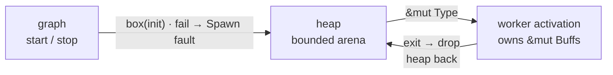

<p class="eyebrow">Concepts</p>

# Heap and state

The reclaimability boundary is a soundness fact, not a preference: **task
storage stays static.** Every `Waker` embassy hands out is an unrefcounted
raw pointer into the task's storage. A stale wake against *reused* storage
is a safe no-op; against *freed* storage it is use-after-free; and nothing
counts outstanding waker clones, so no safe free point exists. A heap-backed
task is therefore off the table, in this library or any sound one.

What **is** reclaimable is future-owned state: everything a task body owns
drops when it returns, and embassy never force-cancels a future (after the
shutdown race, it runs to completion). The supervisor builds on that.

## `state:` per-activation boxed state

Feature `heap-state` (needs a `#[global_allocator]`):

```rust
supervisor_graph! {
    node UPLOAD = Terminate, task: upload_worker,
        state: Buffs = Buffs::new();
}
```

- The spawn glue **fallibly** boxes the init value: an allocation failure is
  a `FaultKind::Spawn` fault, nothing spawned or stranded, retry when the
  heap frees up.
- The shell lends the worker `&mut Type` (after resources, before extras).
- The box **drops on task exit**, before restores and the completion record,
  so `has_exited()` implies the heap is back. Every activation allocates
  fresh: N respawns, net zero heap churn. On a pool, each member boxes its
  own.

`state: zeroed Type` allocates zero-filled instead of building the value in
the spawner's frame: no transient stack copy at any size or opt-level.
`Type` must be `Zeroable` (bytemuck, re-exported).

## The app-provided variants

Zero feature support needed, using resource kinds:

- **`RES: consume Box<T>`**: provide a fresh box before each activation; the
  worker owns it; drop-on-exit frees it; the empty slot makes the next
  respawn fail closed. Use when the *application* decides the allocation,
  for example a free-bytes check before a control `Activate`.
- **`RES: Box<T>`** with the default lend: one allocation kept alive across
  respawns: pay once, reclaim never, no per-cycle churn.

`Box<T>` in any form still needs `T: 'static`; these are placement recipes,
not lifetime escape hatches.

## The graph as admission control

A supervisor graph doubles as a memory budget: stopping a subsystem returns
its future-owned state, its boxed `state:`, and its `consume` resources,
so start/stop becomes the admission control that keeps total usage inside a
budget. This composes with a **fallible heap**: an allocator that can return
"no" and let the caller shed load or answer busy, instead of aborting the
firmware. The supervisor's refusal to spawn without its resources is the
same philosophy applied to structure.



## What never uses the heap

The default build allocates nothing, and none of the supervisor's own
structures touch the heap: node state is static, orders and tables are
flash constants, the mailbox is a fixed array. Enabling pools, control,
health or dataflow does not change that.

## Next

The [pattern gallery](/guides/patterns/) shows the
memory-aware bring-up pattern end to end, and
[Errors and limits](/reference/errors/) collects the
faults these paths can return.
