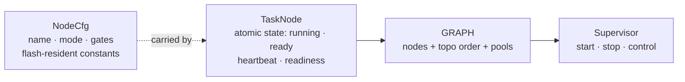

<p class="eyebrow">Concepts</p>

# The model

Everything the supervisor does happens through three kinds of statics. The
macro emits the first two; you construct the third.



## TaskNode

One per managed task, split in two so RAM stays small: a **`TaskNode`**
handle holding the mutable half (running, shutdown requested, ready,
heartbeat, exit record, packed into one atomic word where possible), and a
reference to its **`NodeCfg`**, the immutable half: name, mode, spawn glue,
gate list, budgets and coupling tables. The cfg is a flash-resident static
emitted beside the node, so the constant data costs no RAM. The split and
packing keep per-node state small even with tracing on.

Application code reads the node through methods: `name()`, `mode()`,
`is_running()`, `is_ready()`, `is_stale(..)` and friends. Task code also
*writes* it: `beat()`, `set_ready()`, the shutdown combinators. The full
task-side protocol is on
[Writing supervised tasks](/concepts/tasks/).

## Graph

`supervisor_graph!` emits `pub static GRAPH`. It bundles:

- `nodes`: a fixed array of node references. A node compiled out with
  `#[cfg]` keeps its slot as `None` and is skipped at runtime.
- `topo`: the dependency indices per node and the start order, computed at
  compile time. A graph with no `deps:` anywhere uses a zero-sized `Flat`
  topology instead. The topology is typed by the graph's structural
  **shape**: whether it declares ready deps, executor slots, resources,
  `Pause` or `OnDemand` nodes, heartbeats, `observed` signals, `bound`
  edges or pools. Every lifecycle branch serving a structure the graph
  lacks is compiled out rather than branched over at runtime, so a lean
  graph ships lean code.

You can walk it directly: `GRAPH.iter_nodes()`, `GRAPH.deps_of(i)`,
`GRAPH.dependents_of(i, ..)`, `GRAPH.order()`. Status endpoints and monitors
are usually ten lines over those.

## Supervisor

`Supervisor::new(&GRAPH)` is `const` and infallible (the graph was validated
at compile time). It works over a borrowed graph with no hidden state of its
own, in three tiers of verbs:

| tier | verbs | notes |
|---|---|---|
| whole graph | `start`, `run`, `teardown`, `teardown_continue`, `respawn_terminate`, `resume_pausable` | `run` = `start` + drive pools/control forever |
| single node | `start_node`, `stop_node`, `resume_node` | no cascade |
| subsystem | `activate`, `deactivate`, `apply_control`, `restart` | dependency cascades |

Every fallible verb returns the same error shape.

## One error type, with provenance

```rust
pub struct NodeFault {
    pub node: &'static TaskNode,
    pub kind: FaultKind,
}
```

`FaultKind` names what went wrong: `ExecutorSlotEmpty`, `ResourceMissing`,
`ReadyDepTimeout { dep }`, `Spawn(SpawnError)`, `ShutdownTimeout`. Its
`Display` names the node and the cause, so `panic!("supervisor: {fault}")`
produces an actionable line. All guarantees are cross-thread with proper
atomics: a host test's main thread reads them as safely as another task.

`Aborted` is the cancellation result of the cancellable combinators,
`Resumed` the pause-cycle result of `run_pausable`, and `ControlQueueFull`
is what the synchronous control call returns when the mailbox is full.
Those four types cover the whole crate's error surface.

## What the supervisor never does

It never runs task code: tasks are spawned onto whatever executor the
declaration routes them to. It never allocates. It never owns a HAL. And it
never decides policy for you: what to do about a stale task, a failed
bring-up or a missed shutdown ack is returned as data, and the application
escalates.

## Next

[Declaring the graph](/concepts/dsl/) covers every
clause of the declaration language these statics come from.
