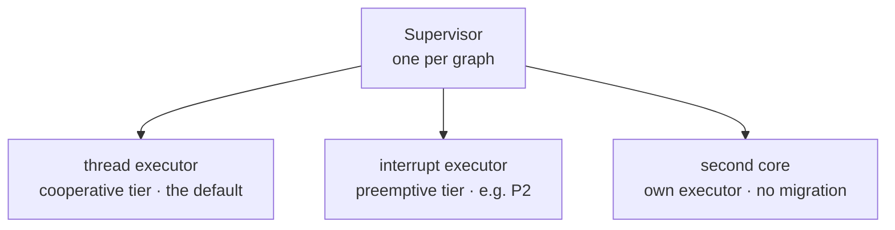

<p class="eyebrow">Concepts</p>

# Executors and cores

One embassy firmware can run several executors at different priorities. The
`executor` mechanism makes the graph the single source of **where each task
runs**: declare a slot, fill it at runtime, and annotate nodes with it, or
make one slot the graph's `default executor` and annotate only the exceptions.



## An interrupt-priority tier

```rust
supervisor_graph! {
    executor HIGH;
    node SAMPLER = Terminate, executor: HIGH, task: sampler_worker;
    node LOGGER  = Terminate, deps: [SAMPLER], task: logger_worker;
}
```

```rust
// app side, before sup.start(..):
static EXECUTOR_HIGH: embassy_executor::InterruptExecutor =
    embassy_executor::InterruptExecutor::new();

interrupt::SWI_IRQ_0.set_priority(interrupt::Priority::P2);
HIGH.set(EXECUTOR_HIGH.start(interrupt::SWI_IRQ_0));
```

`SAMPLER` now preempts the cooperative tier, so a quick sensor read never
waits behind a long request handler, while staying below raw hardware
interrupts. `LOGGER` stays on the thread executor, and the dependency between
them is still honored.

Routing uses embassy's `SendSpawner`. The `Send` bound applies to spawn
arguments, not the future, which is built on the target executor at first
poll. `task:` shell arguments are always `Send`, so any `task:` worker
routes regardless of its future. `spawn:` functions must meet the bound on
their own arguments.

Resources the worker touches on that tier must stay tier-local. `local`
slots are verified: every consumer and provider resolves to one executor.
Values reached through accessors are not verified; see the hazards below.

## The second core

The same slot mechanism spans cores. Core 1 runs its own executor and
publishes its spawner as it boots:

```rust
supervisor_graph! {
    executor CORE1;
    node BENCH = Terminate, executor: CORE1, task: bench_worker, disabled;
}
```

```rust
// core 1 entry (embassy-rp shown; any HAL works):
spawn_core1(p.CORE1, &mut CORE1_STACK, || {
    EXECUTOR1.run(|sp| CORE1.set(sp.make_send()))
});
```

`start()` rendezvouses with that asynchronous publish as part of bring-up
itself, bounded per `executor:` node: a late-booting core is a wait, then a
named fault, never a race. Everything the supervisor does is already
cross-core sound (atomics and critical-section primitives): teardown awaits
acks from the other core, control starts and stops remote nodes, and with
tracing on, the other core's executor shows up as its own line. Register the
one-line `trace::set_core_id_fn` to keep nested accounting exact per core.

Explicit non-goals: task migration and work stealing. Most HAL futures are
not `Send` across cores, so each node lives where the graph puts it. If you
want work on core 1, declare a node (or a pool) with `executor: CORE1`.

## The supervisor on the interrupt tier

The supervisor does not assume thread mode. It uses critical-section
primitives and takes its spawner as an argument. You can run the supervisor
itself on an `InterruptExecutor` while most of the graph stays in thread
mode via a default executor:

```rust
supervisor_graph! {
    default executor THREAD;                 // thread mode, published from main
    executor HIGH;
    node WATCHDOG  = Terminate, task: watchdog_worker;                 // inherits THREAD
    node HEARTBEAT = Pause, executor: HIGH, task: heartbeat_worker;   // says otherwise
}
```

```rust
static EXECUTOR_SUP: InterruptExecutor = InterruptExecutor::new();

#[embassy_executor::main]
async fn main(spawner: Spawner) {
    THREAD.set(spawner.make_send());                  // the default tier is this executor
    interrupt::SWI_IRQ_1.set_priority(Priority::P1);  // above HIGH's P2
    EXECUTOR_SUP
        .start(interrupt::SWI_IRQ_1)
        .spawn(app_supervisor().unwrap());
}

#[embassy_executor::task]
async fn app_supervisor() {
    // Embassy documents this only for the Spawner of an InterruptExecutor.
    let spawner = unsafe { Spawner::for_current_executor() }.await;
    let sup = Supervisor::new(&GRAPH);
    loop {
        let fault = sup.run(&spawner).await;   // returns on ShutdownTimeout
        error!("supervisor: {}", fault);       // report; run() re-enters idempotently
    }
}
```

`default executor` names the slot inherited by every node and pool that
could have written `executor: NAME`. `task:` workers and `spawn:` functions
use it unless their node specifies another executor. Parked nodes and raw
`spawn:` closures use the supervisor's own spawner. One default executor per
graph, at the composition site, never `#[cfg]`-gated.

This inversion improves supervisor responsiveness: fault detection, acks and
teardown no longer queue behind a long thread-mode handler, and a wedged or
hogged thread executor is reported instead of taking the reporter down. The
[reference firmware](/guides/demo-firmware/) uses this layout. Five things
change, none caught by the compiler:

- **State shared across tiers needs a lock sound under preemption.** `local`
  slots are checked per slot; values reached through accessors are not.
  `embassy_net::Stack` contains a bare `RefCell`, so every task that touches
  one stack must stay on one tier.
- **`spawn:` arguments and glue preludes run at the supervisor's priority.**
  `task:` arguments are evaluated on the target tier; `spawn:` arguments and
  `state:` heap boxes run on the supervisor's executor.
- **The supervisor's own work runs elevated**: sweeps, ack-timeout waits,
  teardown waves and pool scaling. That is the point, or the cost.
- **Keep a hardware watchdog feeder on the tier it watches.** A feeder above
  thread mode keeps running through a hogged thread executor and masks the
  hang the watchdog should catch.
- **A second core cannot wake an interrupt executor on its own.** Embassy
  pends an `InterruptExecutor` IRQ in the local NVIC, and each core has its
  own. A wake from the other core is lost, and run-queue coalescing can turn
  that into a permanent supervisor stall. Thread executors are immune
  because `sev` reaches both cores. If the graph spans cores, relay the pend
  through a shared SWI handler or doorbell.

## `task:` extras evaluate on the target tier

A `task:` partial-call argument runs inside the shell at its first poll, on
the node's own executor: an `executor:` node builds its resources on the tier
that runs it. When an argument must instead be snapshotted at spawn time on
the supervisor's executor, switch that node to `spawn:` (case 4 in
[Declaring the graph](/concepts/dsl/#task-vs-spawn)).

## An empty slot is loud

If a slot is never filled, `start()` fails that node with
`FaultKind::ExecutorSlotEmpty` after the bounded wait, naming the node. A
routing mistake is a bring-up error, not a silently mis-placed task.

[Runtime control](/concepts/control/) is the last
piece of the core model: driving all of this from anywhere.
