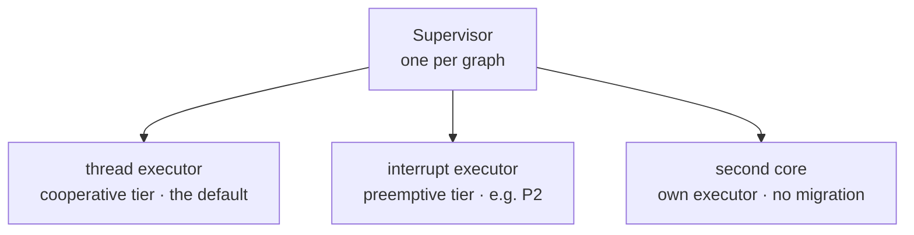

<p class="eyebrow">Concepts</p>

# Executors and cores

One embassy firmware can run several executors at different priorities. The
`executor` mechanism makes the graph the single source of **where each task
runs**: declare a slot, fill it at runtime, and annotate nodes with it.



## An interrupt-priority tier

```rust
supervisor_graph! {
    executor HIGH;
    node SAMPLER = Terminate, executor: HIGH, task: sampler_worker;
    node LOGGER  = Terminate, deps: [SAMPLER], task: logger_worker;
}
```

```rust
// app side, before sup.start(..):
static EXECUTOR_HIGH: embassy_executor::InterruptExecutor =
    embassy_executor::InterruptExecutor::new();

interrupt::SWI_IRQ_0.set_priority(interrupt::Priority::P2);
HIGH.set(EXECUTOR_HIGH.start(interrupt::SWI_IRQ_0));
```

`SAMPLER` now preempts the cooperative tier, so a quick sensor read never
waits behind a long request handler, while staying below raw hardware
interrupts. `LOGGER` stays on the thread executor, and the dependency between
them is still honored. The routed task's future must be `Send`.

## The second core

The same slot mechanism spans cores. Core 1 runs its own executor and
publishes its spawner as it boots:

```rust
supervisor_graph! {
    executor CORE1;
    node BENCH = Terminate, executor: CORE1, task: bench_worker, disabled;
}
```

```rust
// core 1 entry (embassy-rp shown; any HAL works):
spawn_core1(p.CORE1, &mut CORE1_STACK, || {
    EXECUTOR1.run(|sp| CORE1.set(sp.make_send()))
});
```

`start()` rendezvouses with that asynchronous publish as part of bring-up
itself, bounded per `executor:` node: a late-booting core is a wait, then a
named fault, never a race. Everything the supervisor does is already
cross-core sound (atomics and critical-section primitives): teardown awaits
acks from the other core, control starts and stops remote nodes, and with
tracing on, the other core's executor shows up as its own line. Register the
one-line `trace::set_core_id_fn` to keep nested accounting exact per core.

Explicit non-goals: task migration and work stealing. Most HAL futures are
not `Send` across cores, so each node lives where the graph puts it. If you
want work on core 1, declare a node (or a pool) with `executor: CORE1`.

## `task:` extras evaluate on the target tier

A `task:` partial-call argument runs inside the shell at its first poll, on
the node's own executor: an `executor:` node builds its resources on the tier
that runs it. When an argument must instead be snapshotted at spawn time on
the supervisor's executor, switch that node to `spawn:` (case 4 in
[Declaring the graph](/concepts/dsl/#task-vs-spawn)).

## An empty slot is loud

If a slot is never filled, `start()` fails that node with
`FaultKind::ExecutorSlotEmpty` after the bounded wait, naming the node. A
routing mistake is a bring-up error, not a silently mis-placed task.

[Runtime control](/concepts/control/) is the last
piece of the core model: driving all of this from anywhere.
