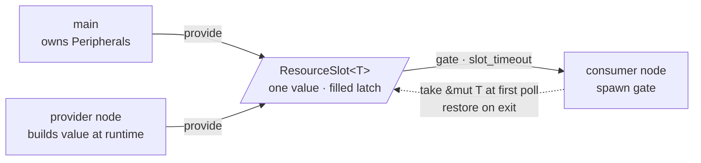

<p class="eyebrow">Concepts</p>

# Resources

A resource is a value **one party builds and one worker owns while it runs**:
a peripheral split out of `Peripherals`, a driver object, a stream endpoint,
a handle an async bring-up produced. Instead of a global registry with
panicking accessors, the graph threads the value into the worker at spawn
through a slot, and "not there yet" becomes a gate the supervisor waits on.



## The protocol

1. Whoever owns the value calls `SLOT.provide(value)` once. Moving a field
   out of `Peripherals` is the compile-time exclusive-ownership guarantee:
   a second owner cannot exist.
2. The supervisor probes the slot just before the (re)spawn. An unfilled slot
   fails bring-up with `FaultKind::ResourceMissing` after a bounded wait (the
   node's `slot_timeout`, 100 ms default), naming the node.
3. The generated shell takes the value at its first poll (never through the
   task-fn call, where a storage clash would drop it unrecoverably) and hands
   the worker `&mut Type`, after the node argument, in declared order. After
   the worker returns, the shell restores the value, so a respawn re-takes
   the same instance.

Who fills the slot? Either **`main`**, before `start()`, for anything that
exists from boot, or a **provider node** for anything built at runtime.
`ResourceSlot<T>` is directly usable: `provide` / `restore`, `take`,
`get() -> Option<T>` (for `T: Copy`), `clear()`, and the async
`wait_take()` used to read exit values. A slot is a mailbox, not a log: a
second provide overwrites.

```rust
supervisor_graph! {
    node BLINK = Terminate, task: blink,
        resources: [LED: embassy_rp::gpio::Output<'static>];
}

// main, after the Peripherals split:
LED.provide(embassy_rp::gpio::Output::new(p.PIN_25, Level::Low));
```

## Kinds: lend, consume, shared, divisible, local

Per-entry markers refine the default lend-and-restore. Pick by what the
worker does with the value:

| kind | worker receives | on worker exit | use for |
|---|---|---|---|
| *(default)* | `&mut Type` | restored; respawn re-takes the same instance | long-lived singletons: an `Output`, a reborrowable peripheral |
| `consume` | `Type` by value | nothing; slot stays **empty** | values the worker must drop at teardown (a driver whose `Drop` releases pins or DMA), or rebuilt fresh each run |
| `shared` | `Type` by value, copied out (`T: Copy`) | nothing; slot **stays filled** | one handle fanned out to many consumers, for example a network stack handle; several nodes, and whole pools, declare the same slot name |
| `local` | as the kind it composes with | as the kind it composes with | `!Send` values that never leave the one executor every declaration of the slot runs on; needs the `local-resources` feature |
| `divisible` | a `Claimant`: the holder's own slot in the graph's budget | share **released** by the supervisor; a `Pause` park keeps it | one quantity split among N holders (a power or bandwidth cap); feature `budget` |

`consume` makes teardown-drop explicit and the wake path honest: until the
application re-provides, a respawn fail-closes with `ResourceMissing` instead
of reusing a stale instance.

`local` is the only kind that requires unsafe code (`unsafe impl Sync`), so
it is opt-in behind the `local-resources` feature. Every access to the slot
value must happen on the same executor. The macro enforces this for every
consumer `resources:` and provider `provides:` declaration, including the
graph's `default executor`. Any executor qualifies, including a second core;
mismatches are compile errors. The macro cannot check the app side, so any
`provide()` from `main` must also run on that executor. The typical pattern
is `shared local`: a single slot of `!Send` handles used on the executor
that created them.

```rust
supervisor_graph! {
    node RADIO = Terminate, task: radio,
        resources: [RUNNER: local consume Cyw43Runner];
}

// bring-up, and again before every wake respawn, before the node comes up:
RUNNER.provide(build_radio_runner().await);
```

## `divisible`: one quantity, many holders

Feature `budget`. Some values are not handed over but split: a site power
budget shared by charging sessions, a bandwidth cap shared by radio links.
`resources: [POWER: divisible]` emits one `pub static POWER: Budget<K>` with
one slot per declaring node and pool member; the macro rejects a budget
sized past 256 holders and any `pool_size > 1` entry (one claimant per
slot).

Each holder's shell receives a `Claimant` bound to its own slot. It states
a want, reads its grant, and waits for the grant to move:

```rust
async fn session(node: &'static TaskNode, mut power: Claimant) {
    power.want(7_000);                        // watts, say
    let mut allowed = power.grant();
    loop {
        match node.run_cancellable_acked(enforce(allowed)).await {
            Err(_aborted) => return,          // the supervisor releases the share
            Ok(_) => allowed = power.wait_grant_change(allowed).await,
        }
    }
}
```

One task is the allocator: it names the slot in `provides: [POWER]`, calls
`POWER.provide(capacity)` when the total changes, and re-divides on
`POWER.wait_change()` under a `BudgetPolicy`. Two ship: `FairShare` (equal
splits) and `ShrinkFastGrowSlow` (cuts land at once, growth returns in
fixed steps). An unprovided budget fails bring-up as `ResourceMissing`,
like any slot. The release rule is the point: a stopped holder never
strands its share. Every stop path releases the holder's slot, including a
holder that misses its shutdown ack; only a `Pause` park keeps the claim,
because the parked task is coming back. The budget costs about `28 + 16*K`
bytes of static RAM for `K` holders; per node the graph adds one claims
slice pointer to the flash config, claimant or not.

*Run it:* the **EV charging site controller** scenario in the
[playground](/guides/playground-scenarios#ev-charging-site-controller) runs
this end to end: a site-wide amp budget re-divided as sessions join and
leave, a derate dial that re-provides, and a stop that hands the stopped
session's share back.

## `provides:`: slots that die with their producer

When a node fills slots at runtime, `provides: [RES, ..]` ties those slots to
its lifetime: the node's shutdown ack clears them, so a consumer's gate waits
for the next activation's value instead of taking the previous cycle's
leftover. `Pause` nodes are excepted: a parked task still backs what it
published.

The clause exists mostly for `shared` slots, which consumers never empty:
without it, "filled" cannot say *which activation* filled it. The graph hands
the producer nothing special; its task names the slot static itself and calls
`provide()` once the value exists.

## `exit:`: typed exit values

`exit: Type` on a `task:` node emits `<NODE>_EXIT: ResourceSlot<Type>`, and
the generated shell provides the worker's **return value** into it just
before recording the exit. Read it with `<NODE>_EXIT.wait_take().await`, or
non-blocking `take()` once `has_exited()` is true. It is a mailbox: the next
completion overwrites an unread value.

The idiom keeps "finished" and "stopped" distinguishable:

```rust
async fn probe(node: &'static TaskNode) -> Result<Report, Aborted> {
    node.run_cancellable_acked(run_probe()).await
}
// node PROBE = Terminate, task: probe, exit: Result<Report, Aborted>;
```

A worker that can never return rejects `exit:` at compile time (rustc
reports unreachable code pointed at the clause). A diverging worker *without*
`exit:` is perfectly legal.

## Resource or signal?

Both are statics two nodes touch, and the graph has a clause for each. They
record different relations:

| | resource | signal |
|---|---|---|
| what it is | a value one party builds and one worker owns | a `static` that exists from boot, any number of tasks touch |
| lifetime | its provider's | the program's |
| relation | ownership hand-over, once per activation | runtime coupling, whole run, may be cyclic |
| gating | consumer's spawn waits for the value | none, unless you gate it |
| examples | a peripheral, a driver, a stack handle | a `Watch`, `Signal`, `Channel`, `Mutex` |

The test is **whether the thing exists before its producer runs**. A
`static W: Watch<..>` does; a UART stream does not. A signal is never a
resource merely because a consumer should not read it early: that is
readiness, or a gated read. The dataflow half of the story is
[Dataflow](/concepts/dataflow/).

## Limits worth knowing

- `resources:` requires `task:` (the generated shell does the take/restore).
- `pool_size > 1` cannot combine with lend, `consume` or `divisible`
  entries: one slot holds one value (a budget: one claimant). Use `shared`,
  or a pool, whose members get per-member slot arrays.
- A panic in the worker skips the restore (on embedded, a panic reboots).

## Next

[Dependencies and gating](/concepts/dependencies/)
covers the other thing that holds a spawn back: readiness.
