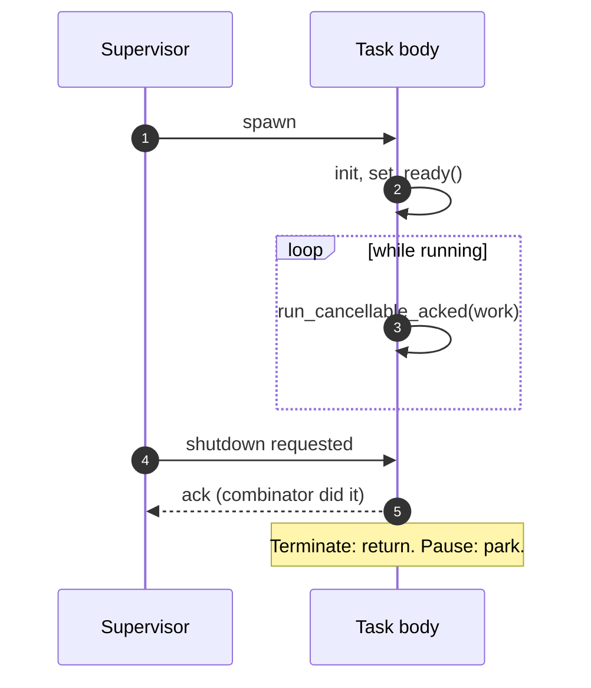

<p class="eyebrow">Concepts</p>

# Writing supervised tasks

A supervised worker is an `async fn` whose first parameter is its node. The
node is the task's half of the lifecycle protocol, and four rules cover all
of it.



1. **Select your work against shutdown** at every await point that can block
   indefinitely, so a stop can reach you. The `run_cancellable*` combinators
   do this for you.
2. **Ack exactly once per stop** with `ack_dropped()`: on exit for
   `Terminate` and `OnDemand`, or before each park for `Pause` (the
   `run_pausable` combinators own that whole tail for you). A task that
   never acks surfaces as a `ShutdownTimeout` fault naming the node once its
   window passes (2 s default, `ack_timeout:` to raise): a loud bug report,
   not a hang.

3. **An autonomous exit calls `mark_exited()`**, which acks *and* records the
   completion, so a worker that returns on its own reads as down and can be
   respawned by a control `Activate`. Shells generated by `task:` do this
   automatically after the worker returns.
4. **Resources follow the mode.** A `Terminate` task re-acquires everything
   on respawn (drop-on-exit is the cleanup). A `Pause` task keeps what it
   holds across park and resume, and never re-acquires.

A worker typed `-> !` cannot return, so stop-and-respawn semantics are inert
on it by type. Give the node `cancel` and the generated shell races the body
against shutdown for you, or keep the node argument and race the work
yourself with one `run_cancellable` call.

## The task-side methods

| method | role |
|---|---|
| `run_cancellable_acked(fut).await` | the everyday body: race `fut` against shutdown and complete the handshake on cancel |
| `run_cancellable(fut).await` | same race, no ack: run cleanup between cancellation and your own `ack_dropped()` |
| `run_pausable(fut).await` | `Pause` bodies: same race, and on a pause it acks, parks, and returns `Err(Resumed)` only after the resume; the loop body is the fresh cycle |
| `run_pausable_loop(body).await` | the whole `Pause` protocol in one call: rebuilds `body` (an async closure) every cycle, never returns |
| `wait_shutdown().await` | the primitive: park until a stop or pause is requested |
| `ack_dropped()` | complete the handshake: clears running, wakes the supervisor's wait |
| `mark_exited()` | ack plus record the completion (`has_exited()`) |
| `wait_resume().await` | `Pause` only: park (after acking) until resumed |
| `mark_busy()` / `mark_idle()` | pool load reporting; a real transition fires the scale signal itself |
| `shutdown_requested()` | synchronous check, for example at the top of a loop |
| `has_exited()` | true once the last instance's body returned; cleared by the next spawn's reset |
| `set_detached(true)` | become self-managed from here on |
| `adopt(&token)` | parked nodes: register a hand-spawned task for trace attribution |

The cancellable combinators return `Result<F::Output, Aborted>` and the
pausable one `Result<F::Output, Resumed>`. Discarding the result
of `run_cancellable_acked` is fine: the ack already happened.

## The canonical loops

**Terminate / OnDemand worker.** Acquire, then serve; respawn re-acquires:

```rust
async fn worker_task(node: &'static TaskNode) {
    let mut conn = acquire().await;
    loop {
        match node.run_cancellable_acked(conn.serve()).await {
            Ok(response) => handle(response),
            Err(_aborted) => return, // acked; drop(conn) is the cleanup
        }
    }
}
```

Use bare `run_cancellable` when cleanup must run between the cancellation and
the ack: flush, unpublish, bracket a busy/idle section.

**Pause node.** Ack, then park; the held resource survives. `run_pausable_loop`
owns the whole protocol:

```rust
async fn sensor_task(node: &'static TaskNode) {
    let mut bus = init_once().await;            // kept across pause/resume
    node.run_pausable_loop(async || {
        let v = sample(&mut bus).await;         // raced against the pause
        publish(v);
    })
    .await                                     // acks, parks, resumes inside; never returns
}
```

Per-cycle `run_pausable` is the same minus the loop, for a body with its own
control flow between cycles. When cleanup must run between the cancellation
and the ack, spell the tail out: `run_cancellable`, the cleanup,
`ack_dropped()`, `wait_resume().await`.

**Pool worker.** Same as Terminate, plus load reporting around the busy
section:

```rust
loop {
    match node.run_cancellable(socket.accept(PORT)).await {
        Err(_aborted) => return node.ack_dropped(),
        Ok(conn) => {
            node.mark_busy();                    // idle->busy signals the pool
            let served = node.run_cancellable(serve(conn)).await;
            node.mark_idle();                    // busy->idle signals again
            if served.is_err() { return node.ack_dropped(); }
        }
    }
}
```

Hold `mark_busy()` for the whole session your resource is tied up; the policy
only shrinks non-busy members.

**Detached daemon.** Detach as the first act, then own your lifecycle:

```rust
async fn power_task(node: &'static TaskNode, spawner: Spawner) {
    node.set_detached(true);   // the supervisor is hands-off from here
    loop { /* drive sleep/wake yourself */ }
}
```

**Parked node.** Declared with neither `task:` nor `spawn:`; the app spawns
it because only it has the values. Keep trace attribution with `adopt`:

```rust
let token = pump_task(&PUMP, hw_handle).unwrap();
PUMP.adopt(&token);
spawner.spawn(token);
```

## Status anyone can read

The same node is a free-standing health handle. Any code that can see the
static, including ISRs and driver callbacks, can call `NODE.beat()` or
`NODE.report_status(..)`; monitors and status endpoints read:

| method | true when |
|---|---|
| `is_running()` | an instance is up (spawned, not acked or exited) |
| `is_busy()` | the instance reported `mark_busy()` |
| `is_disabled()` | stopped at boot or control-deactivated |
| `is_detached()` | self-managed; lifecycle ops skip it |
| `has_exited()` | the last instance's body returned |
| `shutdown_requested()` | a stop or pause was requested |
| `is_ready()` | the task asserted readiness (feature `readiness`) |
| `is_stale(max_age)` | running but no heartbeat within `max_age` (feature `liveness`) |

Compositions worth knowing: **down** is `!is_running()`; a **parked Pause**
node is mode `Pause` plus `!is_running()` plus `shutdown_requested()`; an
**autonomous completion** is `has_exited()` without `shutdown_requested()`.

Ordering guarantees: when `stop_node`, `teardown` or `deactivate` return
`Ok`, the ack has happened and `is_running()` is already false. For bodies
that ack by returning, `has_exited()` is true in the same poll.

## Next

[Lifecycle and modes](/concepts/lifecycle/) shows
what the supervisor does to each of these loops, operation by operation.
