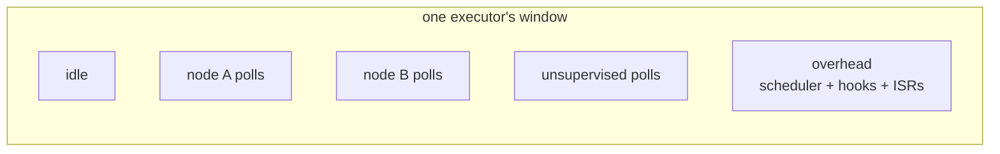

Concepts

# Tracing and profiling

embassy-executor ships raw instrumentation hooks that only know tasks by an
opaque id. The `trace` family makes the supervisor their consumer, with
**node names** attached.

## What you get

- **Per node**: accumulated poll time (`exec_ticks`), poll count, and the
  longest single poll ever (`max_poll_ticks`): the watermark that names a
  task that hogged its executor without ever yielding, even after the fact.
- **Per executor**: a full time decomposition via `trace::executor_stats`:
  idle, in-poll (every task, supervised or not), and by subtraction the
  **executor overhead** and the unsupervised-task share; plus poll and pass
  counters.
- **Live views**: `trace::current_task` and
  `trace::stalled_task(executor, threshold)` for blocked-task detection from
  a context that can still run.

## Reading the numbers

Counters are wrapping `u32` ticks: sample twice, `wrapping_sub`, divide by
the window. The practical reads:

- **CPU share** per node: `exec_ticks` delta over the window.
- **Executor busy% vs the node sum**: busy exceeds the sum by a per-poll
  accounting gap; `ExecutorStats` measures it as `busy − in-poll`, your cue
  for how much scheduling overhead you are paying.
- **Polls per pass** as a wake-storm tell: a task polled many times per
  executor pass is waking on chatty signals.

## The family, split by role

| feature | adds |
|---|---|
| `trace` | the recorders only |
| `trace-hooks` | also defines the hook symbols at the graph site (one set per binary; write your own and forward to `trace::on_*` if you need custom hooks) |
| `metadata-names` | node names stamped into task metadata for external tooling, with **no** recorder overhead and no hook symbols |
| `trace-names` | shorthand for `trace` + `metadata-names` |
| `trace-nested` | preemption-exact accounting: a nested higher-tier poll credits its time back to the window it interrupted |
| `trace-self` | the supervisor's own driver task as a hidden auto-adopted node, instead of the unsupervised share |

`metadata-names` is the piece for a **pure external tracer**: enable it
alongside embassy's own `rtos-trace` feature and SystemView shows your
graph's node names, with none of the supervisor's recorder cost.

## Attribution edges

- Parked nodes and closure-spawned tasks register with
  `TaskNode::adopt(&token)`, or `node.adopt_current().await` from inside the
  body when nobody holds the token.
- On multi-core, register `trace::set_core_id_fn` (one line, for example
  reading `SIO.CPUID` on an RP2350) so `trace-nested` keeps one preemption
  stack per core.
- Up to 4 executors are tracked; graphs register onto a linked chain, any number.

## Known limits

Accounting is preemption-naive without `trace-nested`; hardware ISR time is
invisible either way; attribution is task-granular, so everything else a
task polls is billed to it.

## Next

- [The reference firmware](/guides/demo-firmware/)
  exposes these numbers over HTTP and shows how to read them under load.
- [Testing on your desktop](/guides/testing/): the
  same graph, the same tracing, on your workstation.
