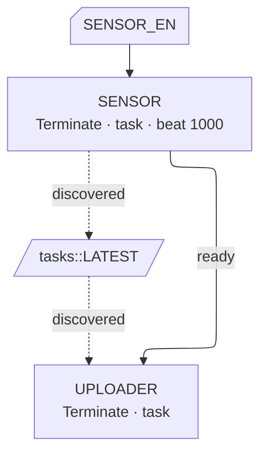
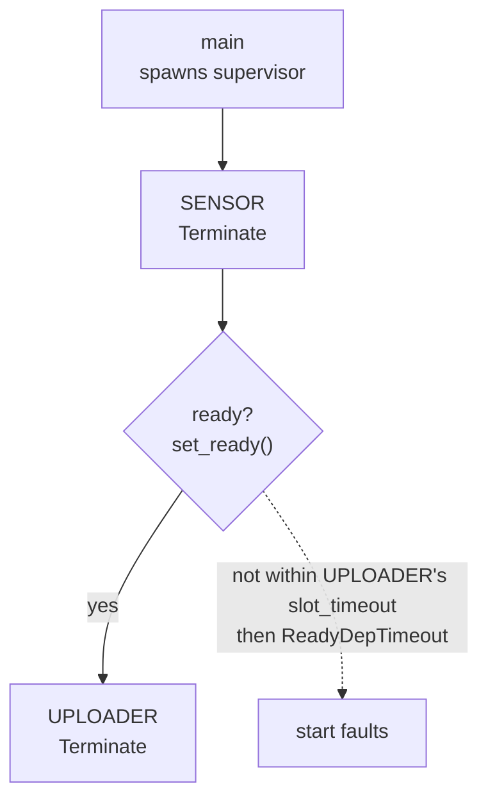

<p class="eyebrow">Start</p>

# Your first graph

This page builds a small but complete supervised firmware: a sensor task that
publishes readings, and an uploader that must not start before the sensor is
producing. Around a hundred lines, and every idea generalizes.

The finished graph:



## 1. The workers

Workers are plain `async fn`s. A supervised worker takes its **node** as the
first parameter; the node is the task's handle for the lifecycle protocol:
shutdown, heartbeat, readiness. You do not write `#[embassy_executor::task]`
yourself. The graph declaration stamps that wrapper for you.

```rust
// src/tasks.rs
use embassy_supervisor::TaskNode;
use embassy_sync::blocking_mutex::raw::CriticalSectionRawMutex;
use embassy_sync::watch::Watch;
use embassy_time::Instant;

#[derive(Clone, Copy)] // Watch hands receivers their own copy
pub struct Sample {
    pub raw: i32,
    pub at_ms: u64,
}

// The cell the sensor writes and the uploader reads. It exists from boot, so
// it is a plain static, not a resource. One receiver: the uploader.
// `pub` keeps this page short; section 7 says what to do in a real firmware.
pub static LATEST: Watch<CriticalSectionRawMutex, Sample, 1> = Watch::new();

pub async fn sensor_task(node: &'static TaskNode) {
    // Cancel-safe body: stops at the next await, returns on shutdown.
    let _aborted = node
        .run_cancellable(async {
            // In a real firmware this is your driver init: I2C, SPI, calibration.
            let mut dev = sensor_driver_init().await;

            // We are producing: dependents waiting on our readiness may start.
            node.set_ready();
            let tx = LATEST.sender();

            loop {
                let raw = dev.sample().await;
                tx.send(Sample { raw, at_ms: Instant::now().as_millis() });
            }
        })
        .await;
}

pub async fn uploader_task(node: &'static TaskNode) {
    let mut rx = LATEST.receiver().unwrap();

    let _aborted = node
        .run_cancellable(async {
            loop {
                let sample = rx.changed().await;
                upload(sample).await; // your transport here
            }
        })
        .await;
}
```

`sensor_driver_init()` and `upload()` are placeholders on purpose: the first
stands for your driver bring-up, the second for your transport. Both are
ordinary `async fn`s; nothing about them is supervised.

Two idioms to remember:

- **`run_cancellable(body)`** wraps the worker body so it can stop at the next
  await. On shutdown the body is dropped and the call returns `Err(Aborted)`.
  Returning completes the stop handshake.
- **`set_ready()`** tells dependents this task is ready to serve.

## 2. The declaration

The graph is one macro invocation. Each item is a run of comma-separated
clauses ending in `;`.

```rust
// src/main.rs
embassy_supervisor::supervisor_graph! {
    node SENSOR = Terminate, task: crate::tasks::sensor_task;
    node UPLOADER = Terminate, deps: [SENSOR ready], slot_timeout: 1000,
        task: crate::tasks::uploader_task;
}
```

The `ready` marker makes `UPLOADER` wait for `SENSOR` to call
`set_ready()`. `Terminate` starts both at boot and restarts them after a wake
cycle.

The wait uses the **dependent's** `slot_timeout`. The default 100 ms suits
resource slots filled before the graph starts, not driver init. Because the
sensor may need longer, `UPLOADER` uses `slot_timeout: 1000`. A missed
readiness deadline becomes a `ReadyDepTimeout` fault.

The macro expands to statics at the call site:

- `pub static SENSOR: TaskNode` and `pub static UPLOADER: TaskNode`,
- `pub static GRAPH`, bundling the node slots, the dependency table and the
  compile-time start order.

You use those statics everywhere else in the application: status endpoints,
control calls, tests. That is the whole generated surface, and it is the same
list for every graph, whatever its size.

## 3. The supervisor task

The supervisor is itself a task, usually spawned from `main`. Its driver
future brings the graph up, then services pools and control requests for the
rest of the run.

```rust
#[embassy_executor::task]
async fn supervisor_task(spawner: embassy_executor::Spawner) {
    let sup = embassy_supervisor::Supervisor::new(&GRAPH);
    // Start the graph and keep driving it. Only returns on a fault.
    let fault = sup.run(&spawner).await;
    defmt::panic!("supervisor: {}", fault);
}
```

`Supervisor::new` is computed at compile time, so it cannot fail. `run()`
starts the graph and runs the driver loop. Split the pieces if the driver
needs to watch other wake sources.

## 4. main

A typical embassy `main` looks like this:

```rust
#[embassy_executor::main]
async fn main(spawner: embassy_executor::Spawner) {
    // HAL init: this is the line that produces `p`, the Peripherals that
    // section 5 takes the pin out of.
    let p = embassy_rp::init(Default::default());

    // Owned values reach nodes through resource slots, handed over before
    // the graph starts. Section 5 wires SENSOR_EN in exactly here.

    spawner.spawn(defmt::unwrap!(supervisor_task(spawner)));
}
```

Build it. If you got a dependency wrong, say `deps: [SENOSR]`, the compiler
underlines the name and reports it as not a declared node or pool. If you
created a cycle, the const evaluation of `GRAPH` panics with a `dependency
cycle` message; the path is not printed, so read it off the declaration.
Nothing waits until the device boots to discover a malformed graph.



## 5. Grow it: a resource

Say the sensor needs a pin that only `main` can move out of `Peripherals`.
Declare a resource slot, and `main` fills it before the graph starts:

```rust
embassy_supervisor::supervisor_graph! {
    node SENSOR = Terminate, task: crate::tasks::sensor_task,
        resources: [SENSOR_EN: embassy_rp::gpio::Output<'static>];
    node UPLOADER = Terminate, deps: [SENSOR ready], slot_timeout: 1000,
        task: crate::tasks::uploader_task;
}
```

```rust
// main, after HAL init. The pin starts low; raising it is the sensor's job.
SENSOR_EN.provide(embassy_rp::gpio::Output::new(p.PIN_15, embassy_rp::gpio::Level::Low));
spawner.spawn(defmt::unwrap!(supervisor_task(spawner)));
```

The worker's signature gains the resource, after the node, as `&mut`. The
body is the one from section 1 with the pin around it:

```rust
pub async fn sensor_task(node: &'static TaskNode, en: &mut embassy_rp::gpio::Output<'static>) {
    en.set_high();

    let _aborted = node
        .run_cancellable(async {
            let mut dev = sensor_driver_init().await;
            node.set_ready();
            let tx = LATEST.sender();
            loop {
                let raw = dev.sample().await;
                tx.send(Sample { raw, at_ms: Instant::now().as_millis() });
            }
        })
        .await;

    // Cleanup runs here, before the resource returns to its slot.
    en.set_low();
}
```

`run_cancellable` lets the worker run cleanup before the shell finishes the
stop handshake and returns the resource to its slot. The `_acked` variant,
covered in the [task reference](../concepts/tasks/), completes the handshake
inside the body instead.

If `main` never provides the pin, the spawn gate times out after
`slot_timeout` (100 ms by default) and reports a named fault instead of
panicking. This pattern works for any owned value. See
[Resources](../concepts/resources/) for `consume` and `shared` kinds.

## 6. Grow it: a heartbeat

Add `beat_timeout:` to a node and its worker's activity becomes measurable:

```rust
node SENSOR = Terminate, task: crate::tasks::sensor_task,
    resources: [SENSOR_EN: embassy_rp::gpio::Output<'static>],
    beat_timeout: 1000;
```

The timeout is only the budget; the worker spends it by calling `node.beat()`
where it has provably made progress. One line in the loop:

```rust
loop {
    let raw = dev.sample().await;
    node.beat(); // one completed conversion is progress
    tx.send(Sample { raw, at_ms: Instant::now().as_millis() });
}
```

A node without `beat_timeout:` is never policed. With it in place, the
supervisor logs a warning the first time the sensor misses its budget.
`SENSOR.is_stale(...)` then reports "running but wedged"; `is_running()`
tells stopped and wedged apart. The application decides what to do. See
[Health monitoring](../concepts/health/).

## 7. Grow it: the dataflow

`ready` only orders bring-up. It does not describe data exchange. To record
that, add `#[embassy_supervisor::dataflow]` and access the cell through the
node.

```rust
#[embassy_supervisor::dataflow]
pub async fn sensor_task(node: &'static TaskNode, en: &mut embassy_rp::gpio::Output<'static>) {
    // ...
            let tx = node.writer(&LATEST).sender(); // the write is recorded
    // ...
}

#[embassy_supervisor::dataflow]
pub async fn uploader_task(node: &'static TaskNode) {
    let mut rx = node.reader(&LATEST).receiver().unwrap(); // the read is recorded
    // ...
}
```

`writer` and `reader` pass the static through unchanged; the attribute notes
the access. Add `discover` to the graph declaration to adopt the tables:

```rust
embassy_supervisor::supervisor_graph! {
    node SENSOR = Terminate, task: crate::tasks::sensor_task, discover,
        resources: [SENSOR_EN: embassy_rp::gpio::Output<'static>],
        beat_timeout: 1000;
    node UPLOADER = Terminate, deps: [SENSOR ready], slot_timeout: 1000,
        task: crate::tasks::uploader_task, discover;
}
```

Now the graph records that `SENSOR` writes `LATEST` and `UPLOADER` reads it.
Because the call site is the declaration, the record stays in sync with the
code. The cost is a few const tables in flash, none at run time. See
[Dataflow](../concepts/dataflow/) for declared `reads:`/`writes:` lists and
heartbeat markers.

One simplification to undo in a real firmware: `LATEST` is `pub`, so other
modules can write it without going through a node, and the graph will not
see those writes. Keep the static private and expose accessors that take a
node and carry `#[dataflow]`. Callers adopt them with `dataflow:
[crate::tasks::publish]`. The full pattern is in
[Dataflow](../concepts/dataflow/).

## Where to go next

- [The model](../concepts/model/): the three statics behind every graph.
- [Lifecycle and modes](../concepts/lifecycle/): what `Terminate`, `Pause`
  and `OnDemand` actually do.
- [Declaring the graph](../concepts/dsl/): every clause, with rules.
- [Dataflow](../concepts/dataflow/): the declared, observed and derived tiers.
