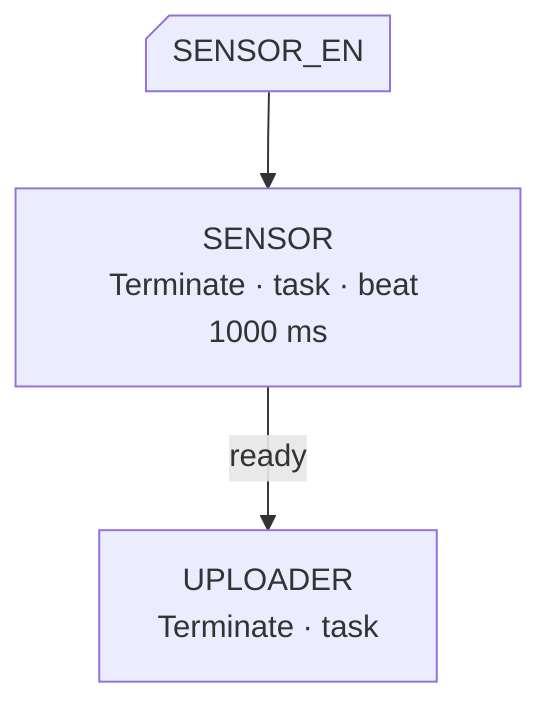
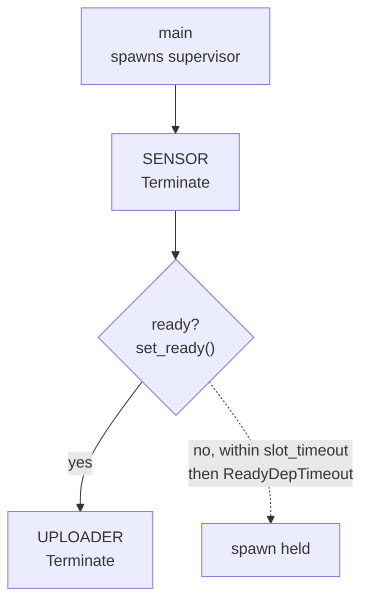

<p class="eyebrow">Start</p>

# Your first graph

This page builds a small but complete supervised firmware: a sensor task that
publishes readings, and an uploader that must not start before the sensor is
producing. Around a hundred lines, and every idea generalizes.

The finished graph:



## 1. The workers

Workers are plain `async fn`s. A supervised worker takes its **node** as the
first parameter; the node is the task's handle for the lifecycle protocol:
shutdown, heartbeat, readiness. You do not write `#[embassy_executor::task]`
yourself. The graph declaration stamps that wrapper for you.

```rust
// src/tasks.rs
use embassy_supervisor::TaskNode;
use embassy_sync::blocking_mutex::raw::CriticalSectionRawMutex;

#[derive(Clone, Copy)] // Watch hands receivers their own copy
pub struct Sample {
    pub raw: i32,
    pub at_ms: u64,
}

// The shared cell both tasks communicate through. It exists from boot, so it
// is a plain static, not a resource.
pub static LATEST: embassy_sync::watch::Watch<CriticalSectionRawMutex, Sample, 2> =
    embassy_sync::watch::Watch::new();

pub async fn sensor_task(node: &'static TaskNode) {
    // In a real firmware this is your driver init: I2C, SPI, calibration.
    let mut dev = sensor_driver_init().await;

    // We are producing: dependents waiting on our readiness may start now.
    node.set_ready();
    let tx = LATEST.sender();

    loop {
        // Race the work against a shutdown request, and ack on cancel.
        match node
            .run_cancellable_acked(dev.sample())
            .await
        {
            Ok(raw) => tx.send(Sample { raw, at_ms: embassy_time::Instant::now().as_millis() }),
            Err(_aborted) => return, // shutdown: the ack already happened
        }
    }
}

pub async fn uploader_task(node: &'static TaskNode) {
    let mut receiver = LATEST.receiver().unwrap();
    loop {
        match node.run_cancellable_acked(receiver.changed()).await {
            Ok(sample) => upload(sample).await, // your transport here
            Err(_aborted) => return,
        }
    }
}
```

`sensor_driver_init()` and `upload()` are placeholders on purpose: the first
stands for your driver bring-up, the second for your transport. Both are
ordinary `async fn`s; nothing about them is supervised.

Two idioms to internalize now:

- **`run_cancellable_acked(work)`** races the future you pass against a
  shutdown request. On shutdown it cancels the work and completes the
  handshake for you, so returning from the function is the whole cleanup.
- **`set_ready()`** asserts that this task is actually serving. It is what a
  `ready` dependency waits for, explained below.

## 2. The declaration

The graph is one macro invocation. Each item is a single line of
comma-separated clauses ending in `;`.

```rust
// src/main.rs
embassy_supervisor::supervisor_graph! {
    node SENSOR = Terminate, task: crate::tasks::sensor_task;
    node UPLOADER = Terminate, deps: [SENSOR ready], task: crate::tasks::uploader_task;
}
```

Read it as: two tasks; `UPLOADER` depends on `SENSOR`; the `ready` marker
means the uploader's spawn additionally waits for the sensor's `set_ready()`
call. The mode `Terminate` means both are started at boot and respawned after
a wake cycle.

That invocation expands to statics at the call site:

- `pub static SENSOR: TaskNode` and `pub static UPLOADER: TaskNode`,
- `pub static GRAPH`, bundling the node slots, the dependency table and the
  compile-time start order.

You use those statics everywhere else in the application: status endpoints,
control calls, tests. That is the whole generated surface, and it is the same
list for every graph, whatever its size.

## 3. The supervisor task

The supervisor is itself a task, usually spawned from `main`. Its driver
future brings the graph up, then services pools and control requests for the
rest of the run.

```rust
#[embassy_executor::task]
async fn supervisor_task(spawner: embassy_executor::Spawner) {
    let sup = embassy_supervisor::Supervisor::new(&GRAPH);
    // Brings SENSOR up, waits for its readiness, then spawns UPLOADER.
    // Returns only on a fault; escalate as suits the product.
    let fault = sup.run(&spawner).await;
    panic!("supervisor: {}", fault);
}
```

`Supervisor::new` is infallible because the start order was already computed
at compile time. `run()` is `start()` plus the driver loop; you can call the
pieces separately when the driver must also watch other wake sources.

## 4. main

A typical embassy `main` looks like this:

```rust
#[embassy_executor::main]
async fn main(spawner: embassy_executor::Spawner) {
    // HAL init: this is the line that produces `p`, the Peripherals that
    // section 5 takes the pin out of.
    let p = embassy_rp::init(Default::default());

    // Owned values reach nodes through resource slots, handed over before
    // the graph starts. Section 5 wires SENSOR_EN in exactly here.

    spawner.spawn(supervisor_task(spawner).unwrap());
}
```

Build it. If you got a dependency wrong, say `deps: [SENOSR]`, the compiler
underlines the name and reports it as not a declared node or pool. If you
created a cycle, the const evaluation of `GRAPH` panics with a `dependency
cycle` message; the path is not printed, so read it off the declaration.
Nothing waits until the device boots to discover a malformed graph.



## 5. Grow it: a resource

Say the sensor needs a pin that only `main` can move out of `Peripherals`.
Declare a resource slot, and `main` fills it before the graph starts:

```rust
embassy_supervisor::supervisor_graph! {
    node SENSOR = Terminate, task: crate::tasks::sensor_task,
        resources: [SENSOR_EN: embassy_rp::gpio::Output<'static>];
    node UPLOADER = Terminate, deps: [SENSOR ready], task: crate::tasks::uploader_task;
}
```

```rust
// main, after HAL init:
SENSOR_EN.provide(Output::new(p.PIN_15, Level::High));
spawner.spawn(supervisor_task(spawner).unwrap());
```

The worker's signature gains the resource, after the node, as `&mut`:

```rust
pub async fn sensor_task(
    node: &'static TaskNode,
    en: &mut embassy_rp::gpio::Output<'static>,
) { /* ... */ }
```

Now "the enable pin was not provided" cannot become a task panic: the spawn
gate holds for up to the node's `slot_timeout` (100 ms by default) and then
fails as a named fault. This is the pattern for every owned value: pins,
driver objects, stream endpoints, network handles. Details and the
`consume` and `shared` kinds are in [Resources](../concepts/resources/).

## 6. Grow it: a heartbeat

Add `beat_timeout:` to a node and its worker's activity becomes measurable:

```rust
node SENSOR = Terminate, task: crate::tasks::sensor_task, beat_timeout: 1000;
```

The timeout is only the budget; the worker spends it by calling `node.beat()`
where it has provably made progress:

```rust
loop {
    match node.run_cancellable_acked(dev.sample()).await {
        Ok(raw) => {
            node.beat(); // one completed conversion is progress
            tx.send(Sample { raw, at_ms: embassy_time::Instant::now().as_millis() });
        }
        Err(_aborted) => return,
    }
}
```

A node that declares `beat_timeout:` but never beats reads permanently stale
one budget after it starts, which is why a node without a budget is opted out
of policing entirely. With both halves in place, anywhere in the application,
`SENSOR.is_stale(Duration::from_secs(2))` answers "is it running but
wedged?": it returns false for a node that is merely stopped, and
`is_running()` distinguishes the two. A health monitor can act on it. See
[Health monitoring](../concepts/health/).

## Where to go next

- [The model](../concepts/model/): the three statics behind every graph.
- [Lifecycle and modes](../concepts/lifecycle/): what `Terminate`, `Pause`
  and `OnDemand` actually do.
- [Declaring the graph](../concepts/dsl/): every clause, with rules.
