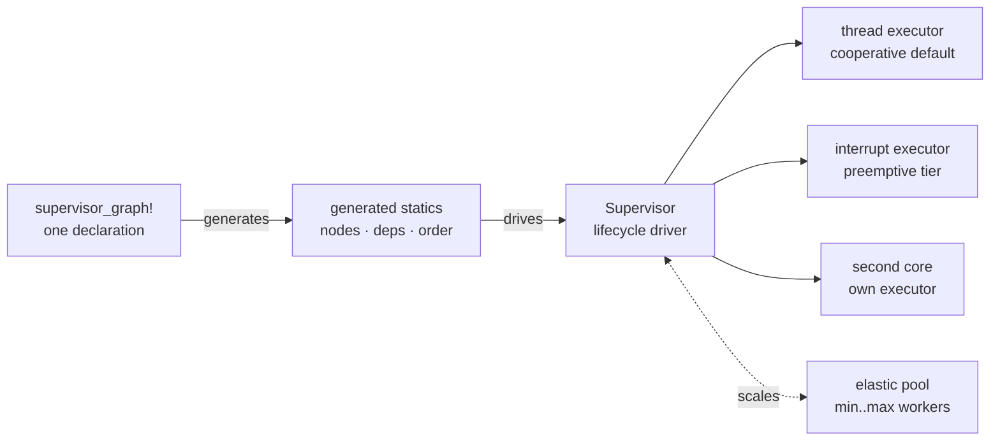

Start

# Overview

- Embedded firmware has historically been built from super loops,
  interrupts, or RTOS threads. As the number of communication stacks,
  sensors, and control loops grows, the wiring between tasks becomes the
  dominant problem.

- embassy brings cooperative multitasking with Rust's `async/await` to
  embedded. Tasks compile into state machines that yield on blocking I/O,
  so a single executor can run many logical tasks without the stack
  overhead of an RTOS thread.

- **embassy-supervisor is the coordination layer for that model.** It lets
  you declare the architecture of the whole firmware once: tasks, their
  dependencies, the resources they share, the heartbeats that watch them,
  and the control points that let the system react at runtime.

- The compiler validates the static topology. The runtime brings the graph
  up deterministically, reacts to failures, and exposes every node to
  runtime control. Each capability is opt-in through Cargo, so the binary
  contains only what the system uses.

- It is built for products where the cooperative model must stay correct
  under pressure: industrial controllers, automotive ECUs, FPV flight
  stacks, protection relays, medical devices, and always-on gateways.

## Core capabilities

- **Declarative system architecture.** Describe tasks, executors,
  dependencies, resources, pools, and dataflow in a single checked
  declaration. The graph becomes generated statics and compile-time
  validation, not runtime discovery.

- **Deterministic lifecycle orchestration.** `Terminate`, `Pause`,
  `OnDemand`, and pool member modes give each task a contract the supervisor
  honors: respawn, park with held state, or scale on demand. Bring-up order
  is derived from `deps:` and enforced by the runtime.

- **Runtime coupling and resilience.** `bound` edges stop dependents with
  their provider and restart them together. `restart` re-gates a subtree
  through its full sequence. Generation counters let consumers detect
  provider restarts without polling.

- **Resource safety and sharing.** `Backed` signals start their producer on
  first demand. `lease()` and `drain()` count active readers so a resource
  cannot be freed while held. `divisible` budgets split a quantity across
  holders and reclaim a stopped holder's share. `veto` gates implement
  fail-safe latching: a writer sets a safe state until every contributor
  releases it.

- **Health and fault containment.** Per-node heartbeat budgets, stall
  detection, and status reporting give the system a single source of truth
  about liveness without modifying producer code. Dataflow declarations make
  affected nodes explicit.

- **Elastic scaling.** Pools grow under load and shrink after a cooldown,
  bounded by a `min:`/`max:` member budget declared in the graph.

- **Runtime control plane.** Start, stop, restart, pause, resume, and
  teardown any node or subtree on command, from a request handler, a
  power-coordinator, or a test harness.

- **Observable execution.** Per-task poll counts, CPU share, and
  per-executor tracing attribute behavior to node names. The same traces
  drive both the playground and on-target tooling.

- **Composable and modular.** Split declarations with
  `supervisor_fragment!` and compose them with `compose_graph!`. Only the
  macro is on by default; every capability is a Cargo feature, so the binary
  contains only the code the graph uses.

## Built for critical systems

The same concepts appear across very different product domains:

- **Industrial PLCs and process controllers.** A fieldbus stack must come
  up before the I/O tasks that use it, and a watchdog heartbeat must be
  independent of the logic it protects. `deps:`, `ready` gating, and
  `beat_timeout:` turn that into checked declarations.

- **Automotive ECUs and powertrain modules.** A `Pause`'d driver holds a
  bus configuration across sleep cycles so wake-up is a resume, not a cold
  init. `control` verbs let a power-coordinator sequence shutdown before an
  OTA flash and roll back to the previous image if the update fails.

- **FPV and robotics flight stacks.** A radio link, IMU filter, estimator,
  and motor controller run on different executor tiers with different
  latency requirements. The supervisor assigns nodes to executors and
  restarts a failed telemetry task without disturbing the control loop.

- **Substation protection and grid IEDs.** A `veto` gate latches a trip
  state until every protection element agrees to release it. `dataflow:`
  records make the safety case auditable: every reader and writer is
  declared.

- **Medical devices and life-support peripherals.** Leased handles on a
  shared driver ensure a measurement task cannot outlive the resource it
  reads. `drain()` gives clean shutdown before sterilization, calibration,
  or update.

- **Telecom and network edge gateways.** An elastic pool of session
  handlers absorbs registration bursts, then shrinks during quiet periods.
  Runtime `restart` and `deactivate` cascades isolate a faulty modem
  without restarting the whole gateway.

Because each capability is behind a feature, a small sensor node can use
only dependency ordering while a multi-core ECU uses the full set. The
declaration scales with the product.

## Before you continue

You will get the most out of these docs if you are comfortable with:

- Writing Rust and using Cargo. The [Rust book](https://doc.rust-lang.org/book/)
  is the standard reference.
- How async works in principle: futures are state machines, executors poll
  them. The [Rust async book](https://rust-lang.github.io/async-book/) covers
  the model.
- Basic embassy vocabulary: tasks, `Spawner`, `#[embassy_executor::task]`.
  The [embassy docs](https://embassy.dev/book/) are the place to start, and
  `no_std` embedded background is in the
  [Embedded Rust book](https://docs.rust-embedded.org/book/).

None of that needs to be deep. This site links out to the details when they
matter.

## Where to go next

- [Installation](/getting-started/install/): add the
  crate and pick features.
- [Your first graph](/getting-started/first-graph/):
  a working example, line by line.
- Prefer video? There is a
  [walkthrough of the architecture](https://youtu.be/rlLaaMKMPWo) covering
  the graph declaration, executor tiers and the lifecycle model.
- The source lives on
  [GitHub](https://github.com/cedrivard/embassy-supervisor), and the API on
  [docs.rs](https://docs.rs/embassy-supervisor).
