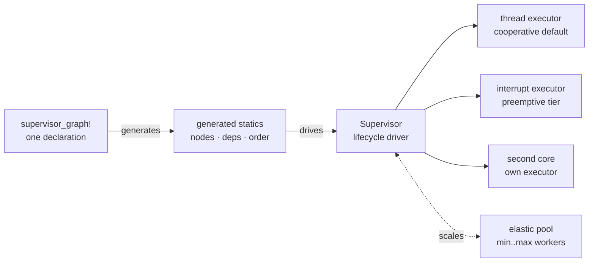

Start

# What it is

Writing firmware with Rust and [embassy](https://embassy.dev) feels great
right up until the day your project has a radio, three sensors, a web
endpoint, a power budget and an update path. Each piece is an easy `async fn`.
The hard part is everything between them: which one starts first, what to do
when a driver is not ready yet, who must stop before you can drop the network
stack, and how any of that survives a sleep cycle or an OTA swap.

**embassy-supervisor is a small `no_std` library that takes over that
coordination.** You describe your tasks and their relationships once, in a
declaration the compiler checks, and a supervisor brings the graph up in
order, hands each task what it needs, watches the connections between them,
and takes it all down cleanly on demand.

## What you get

- **A lifecycle per task.** `Terminate` tasks respawn fresh. `Pause` tasks
  park while keeping a held resource such as an open bus or socket.
  `OnDemand` tasks exist to be scaled by a pool.
- **Runtime coupling.** The graph reacts to what its tasks do: generation
  counters let a running consumer notice a restarted provider, `bound`
  edges stop dependents whose provider goes down and bring them back with
  it, and `restart` re-gates one subtree through its full gate sequence.
- **Gated spawning.** A task that needs a value (a peripheral, a driver
  object, a network handle) waits for it before spawning. A missing value is
  a named, retryable error, not a panic inside a running task. Readiness can
  even mean "actually producing", asserted by the first real output.
- **Gated reads and counted holds.** Reading a signal can start its
  producer and wait for it, and leased handles are counted so a producer
  cannot free a value a consumer still holds.
- **Runtime control.** Start, stop, restart, pause and resume any node or a
  whole subtree, from a request handler, a button, or a test.
- **A health sweep.** Per-node heartbeat budgets with stall and recovery
  events, one report per incident, and a one-line status per node.
- **Elastic worker pools.** Grow under load, shrink after a cooldown, within
  a member budget declared in the graph.
- **Declared dataflow.** Say who writes and who reads each shared signal, or
  derive it from the code itself. The graph can answer "who is affected if
  this producer restarts", feed heartbeats, and drive tooling.
- **A footprint that tracks the declaration.** Code for structures your
  graph lacks is compiled out, and only the macro is on by default: more
  explicitness, smaller binaries.
- **Tracing.** Per-task CPU time and poll counts, per-executor idle and
  overhead, attributed by node name.

Each of those is optional at build time. Only the dependency-ordered core
plus the macro are on by default; everything else is a Cargo feature.

## What it is not

- **Not a kernel.** There is no scheduler to replace, no per-task stacks, no
  context switching. Tasks are ordinary embassy tasks; the supervisor only
  starts, parks and stops them.
- **Not a HAL.** It owns no pins, no clocks, no drivers. The same library
  runs on any embassy target and on your desktop for tests.
- **Not a panic catcher.** A panicking task is not captured or restarted;
  that is not possible from a `forbid(unsafe_code)` no_std library. Pair the
  supervisor with a hardware watchdog for crashes, and with its liveness
  heartbeats for tasks that hang instead of crash.
- **Not an allocator requirement.** The default build allocates nothing.
  Heap-backed per-activation state exists, but only behind an explicit
  feature.

## Where it earns its keep

When the hard part stops being each `async fn` and becomes the wiring
between them, the graph earns its keep. A few shapes recur across very
different products:

- **Bring up the world in a known order.** A radio before its
  subscribers, an OTA confirm before the next flash attempt, a network
  stack before any HTTP server that uses it. `deps:` makes that order
  the same string the compiler checks.
- **Have a reader start its provider.** A `Backed` signal waits for its
  producer on the first `open`, so the bring-up wave can wire a
  consumer declared before its provider with no `deps:` edge. The wait
  re-checks on every retry, so a producer that runs but stops
  reporting ready does not pin the reader; a user-implemented
  `Gated::ensure` can layer any other policy on top, including a wedge
  check.
- **Wake briefly, publish, sleep.** One or more drivers park in `Pause`
  holding a resource, so the next wake is a millisecond resume rather
  than a cold reinit.
- **Answer "who is affected if X cycles" without reverse-engineering.**
  The dataflow record keeps writers and readers next to deps, so the
  graph answers the question directly and tooling stays accurate as
  nodes come and go.
- **Take a provider down without dropping a held handle.** `lease()`
  counts every holder of a resource and `drain()` waits for them, so a
  `Pause`'d driver never frees a `Stack` a serving task is still
  reading.
- **Heartbeat a task without touching the task.** A `writes: [X
  observed beat]` entry turns a normal write into the node's heartbeat,
  so the producer body stays oblivious to liveness.
- **Stay on, absorb bursts.** An elastic pool grows workers when load
  spikes and drains them during quiet times, bounded by the member
  budget the graph declares.
- **Take an update without dropping live requests.** When a flash needs
  the network down, dependents drain through their gate sequence; a
  failed update leaves the previous image running with consumers still
  fed.

A single-task blinky does not need it. Two or three cooperating tasks
with manual sequencing can go either way. Past that, the declaration
usually pays for itself.

## Before you continue

You will get the most out of these docs if you are comfortable with:

- Writing Rust and using Cargo. The [Rust book](https://doc.rust-lang.org/book/)
  is the standard reference.
- How async works in principle: futures are state machines, executors poll
  them. The [Rust async book](https://rust-lang.github.io/async-book/) covers
  the model.
- Basic embassy vocabulary: tasks, `Spawner`, `#[embassy_executor::task]`.
  The [embassy docs](https://embassy.dev/book/) are the place to start, and
  no_std embedded background is in the
  [Embedded Rust book](https://docs.rust-embedded.org/book/).

None of that needs to be deep. This site links out to the details when they
matter.

## Where to go next

- [Installation](/getting-started/install/): add the
  crate and pick features.
- [Your first graph](/getting-started/first-graph/):
  a working example, line by line.
- Prefer video? There is a
  [walkthrough of the architecture](https://youtu.be/rlLaaMKMPWo) covering
  the graph declaration, executor tiers and the lifecycle model.
- The source lives on
  [GitHub](https://github.com/cedrivard/embassy-supervisor), and the API on
  [docs.rs](https://docs.rs/embassy-supervisor).
