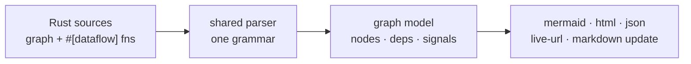

<p class="eyebrow">Guides</p>

# Diagram and lint tools

The `embassy-supervisor-tools` crate ships two host tools that read your graph
declaration straight out of the Rust source: the same parser, the same
scanner the `#[dataflow]` attribute uses, so the output is the build's view
by construction.

```console
cargo install embassy-supervisor-tools
```

## supervisor-mermaid

Run it from the crate whose graph you want drawn:

```console
$ cd firmware && supervisor-mermaid
```

No arguments means "this crate". Point it at things explicitly when the
graph spans files or crates (a compose site plus its fragments, or the files
holding the `#[dataflow]` fns a `discover` node binds; `--deps` adds the
workspace's path dependencies):

```console
$ supervisor-mermaid src/main.rs src/tasks.rs
$ supervisor-mermaid --deps src/main.rs
```

### The three diagrams

**Bring-up** (the default) answers *what starts after what*. A `deps:` edge
joins two boxes and its weight says how much is enforced: plain is spawn
order, `ready` awaits `set_ready()`, thick `ready bound` propagates
readiness. Resource slots are drawn too: an unfilled one fails the spawn, so
it gates bring-up as much as a dep does.

**Runtime** (`--runtime`) answers *what the running system looks like*:
every signal and resource, no bring-up edges. Coupling always routes through
a signal box, so it can never be mistaken for a dep; the two relations are
not the same one. `--runtime-deps` restores every `deps:` edge as dotted
spawn context beside the solid lifetime coupling.

**Lifecycles** (`--states`) answers *what happens to one node over its
life*: a state diagram with only the transitions the declaration implies.
With `--signals`, one composite per node, carrying the concrete gates: the
slots its spawn takes, the readiness it waits on, the slots a stop clears.

### Getting the output somewhere useful

- `--live-url`: a mermaid.live share link, nothing to install.
- `--html FILE`: one self-rendering page (mermaid.js from a CDN).
- `--render FILE`: svg/png/pdf through `mmdc`.
- `--update FILE.md`: rewrites the managed block between
  `<!-- supervisor-mermaid:start/end -->` markers in a markdown file, and
  touches nothing else. With `--watch`, the file follows the source as you
  edit. This is how a README keeps a current picture of its graph.
- `--json`: the graph model (nodes, deps, resources, signals, scanned
  accesses; signals carry their `veto` marker, resources their `divisible`
  and `serialized` kinds) for anything that is not a diagram.

Layout help on bigger graphs: `--layout elk`, `--max-fanout 6` to collapse a
widely-read signal into one aggregate box, `--legend` for a key,
`--executors` to box nodes by the executor they spawn through,
`--fragments` to box each fragment's items.



## supervisor-lint

The same model, asked what its dataflow is missing: a signal some node reads
that nothing writes (`orphan-reads`), a signal some node writes that nothing
reads (`dead-writes`). The static shape of diagnostics a running supervisor
logs, at build time instead of on a serial console.

```console
$ cd firmware && supervisor-lint
$ supervisor-lint --only dead-writes --allow RATE_PID_TERMS src/
```

Every finding exits non-zero: this is a CI gate, not a report. A one-sided
signal is often a real, accepted absence (an input this target has no
producer for, a telemetry tap nothing consumes yet), so `--allow` names the
accepted ones in the invocation, where it gets reviewed like code. An
`--allow` entry that no longer suppresses anything is itself reported.

`public-gate` is the third finding: a `Backed`, `Leased` or `VetoGate`
static that is not private. Gates guard the access path, not the data; the
module boundary is what makes bypass deliberate (see
[Gated reads and leases](/concepts/data-deps/)).

`observed`/`beat` entries are exempt from dead-write findings by design:
their consumer is the supervisor.

## `--check`: keeping graph and code in lockstep

`supervisor-mermaid --check` verifies and stops: it fails when the graph
names a `#[dataflow]` fn no scanned file defines, or a scanned fn no node
binds. Both are how a signal comes to look one-sided when it is not. The CI
shape:

```console
supervisor-mermaid --check --deps src/ && supervisor-lint --deps src/
```

Together the two tools pin the two halves: the diagram cannot drift from
the declaration, and the dataflow cannot grow silent holes.

## Next

[The reference firmware](/guides/demo-firmware/)
runs these tools on a real graph and shows the artifacts.
